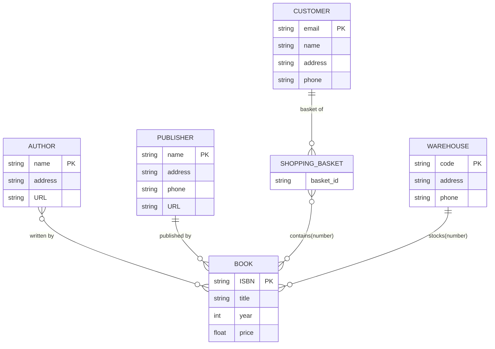

# 11. ER model

ER model : entity-relationship model

## 11.1. entity and entity set

An entity is a "thing" or "object" that can be distinguished from all other objects in the real world. An entity set is a collection of entities of the same type.

### 11.1.1. 复杂属性强实体集

## 11.2. Example

Here is an simple example of a library management system

![[attachments/Pasted image 20250522191013.png]]
