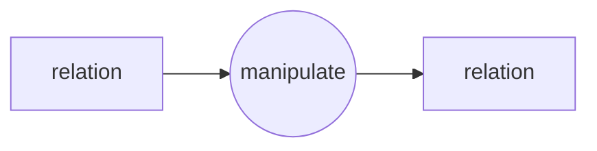
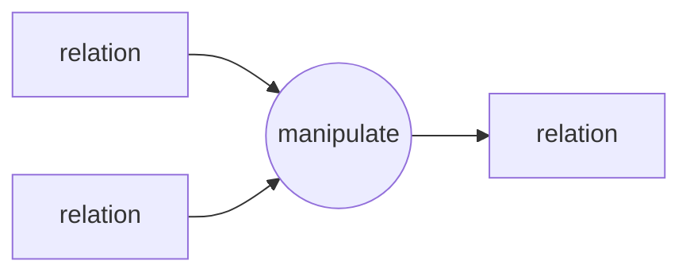
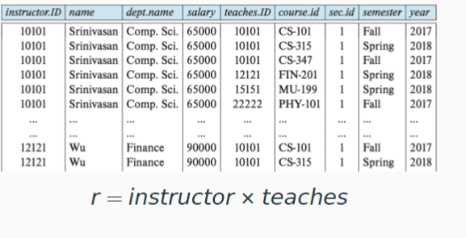

# 1. relation algebra

> Relational algebra is the theoretical foundation of SQL

Relational algebra is defined over`  relations, tuples and attributes. `

Operations are applied either to a single relation or to two relations**.The result is always a single relation.**

## 1.1. SELECT

e.g1: Select all teachers whose `dept_name` is `Physics`.

$$
\sigma_{dept\_name=\text{"physics"}}(\text{instructor})
$$

e.g2: Select all teachers with `salary greater than 90000'.

$$
\sigma_{salary>90000}(\text{instructor})
$$

Comparison operations on predicates (predicate) can use the symbols: $>, <, =, \geq,\leq,\neq$.In addition, multiple predicates can be combined by `logical connectives`:

- and: $\land$
- or:  $\lor$
- not: $\neg$

e.g3: Select all teachers in the Physics Academy with a salary greater than 90000.

$$
\sigma_{\text{physics}=\text{"Physics"} \land \text{salary >90000}}(\text{instructor})
$$

## 1.2. PROJECT

e.g1: Returns the name, dept_name, and salary of all teachers.

$$
\Pi_{\text{ID,dept\_name,salary}}(\text{instructor})
$$

- select($\sigma$) : Intercepts relationships horizontally, affecting [line].
- project($\Pi$) : Intercepts relationships vertically, affects [columns].

Moreover, the generic projection operation allows simple arithmetic on attributes:

$$
\Pi_{\text{ID,dept\_name,salary/12}}(\text{instructor})
$$

## 1.3. Combination of relational operations

e.g4: Find the`  names ` of `all Physics` faculty members.

$$
\Pi_{name}\left(\sigma_{dept\_name}=\text{"Physics"}\left(\text{instructor}\right)\right)
$$

e.g5: Find information on all faculty members belonging to the ` Physics' or  `Chemistry' department.

$$
\sigma_{dept\_name=\text{"Physics"} \lor \text{dept\_name="Chemistry"}}(\text{instructor})
$$

e.g6: Find name and salary of the teacher with ID 10101

$$
\Pi_{\text{name,salary}}(\sigma_{\text{ID=10101}})(instructor)
$$

## 1.4. Cartesian product

$$
A \times B = \{(a,b):a\in A,b\in B \}
$$

- instructor(ID, name, dept_name, salary)
- teaches(ID, course_id, sec_id, semester, year)
- The schema of r = instructor $\times$ teaches ： r(instructor.ID, name, dept_name, salary, teaches.ID, course_id, sec_id, semester, year)

Find information about all the teachers and their classes:

### 1.4.1. JOIN

JOIN is a combination of Cartesian product and selection:

$$
\text{instructor}  \bowtie_{\text{ intructor.ID=teaches.ID}}\text{teaches}
$$

- natural join

If the $\theta$ condition is that **attribute values of the same name are equal**, it can be omitted .In this case, it is called a `natural join`.

$$
\text{instructor} \bowtie  \text{teaches}
$$

## 1.5. UNION, INTERSECT, DIFFERENCE

e.g. section(course_id, sec_id, semester, year, building, room_number, time_slot_id); Find all courses that are in both the Fall 2017 semester and Spring 2018 semester

$$
\Pi_{\text{course\_id}}(\sigma_{\text{semester="Fail"}\land \text{year=2017}}(\text{section})) \cap\Pi_{\text{course\_id}}(\sigma_{\text{semester="Fail"}\land \text{year=2018}}(\text{section}))
$$

_**The precondition for two relations to perform the parallelism operation is that they are ==compatible==, i.e., the two relations have the==same arity== and each corresponding attribute is of the ==same type==.**_

e.g. Find the names of all employees with a salary greater than $10,000

- employee($\underline{\text{ID}}$, person_name, street, city)
- works($\underline{\text{ID}}$, company_name, salary)
- company($\underline{\text{company\_name}}$, city)

$$
\Pi_{\text{person\_name}}(\sigma_{\text{salary>10000}}(\text{works} \bowtie \text{employee}))
$$