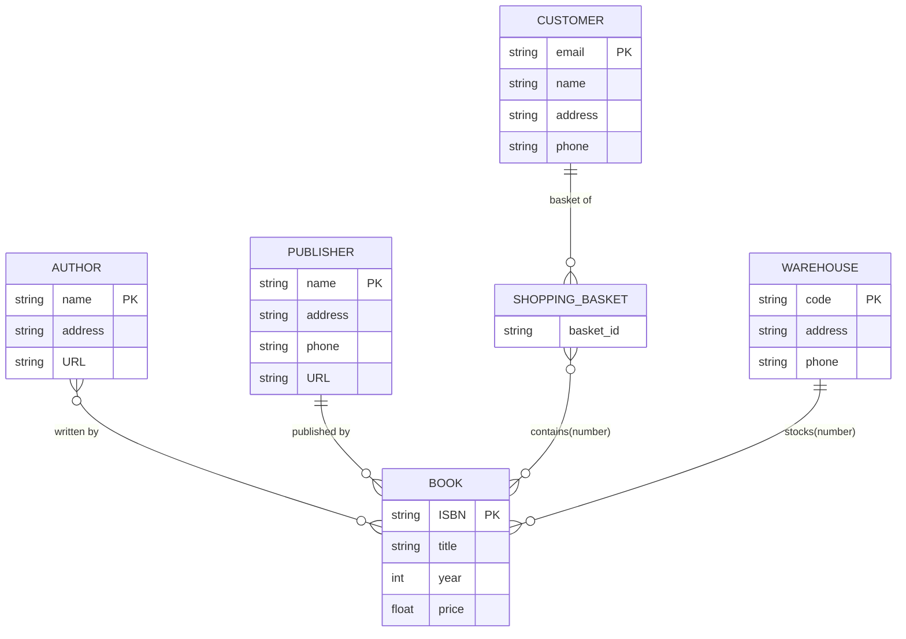

# 1. ER model

ER model : entity-relationship model

## 1.1. entity and entity set

An entity is a "thing" or "object" that can be distinguished from all other objects in the real world. An entity set is a collection of entities of the same type.


## 1.2. relationship and relationship set

A relationship is an interconnection between multiple entities. A relationship set is a collection of the same type of relationship.


## 1.3. E-R figure

e,g,


## 1.4. Attribute

### 1.4.1. domain

For each attribute, there is a set of allowable values called a domain.

### 1.4.2. category

According to different criteria, it can be divided into:

- simple attributes: not subdividable; composite attributes: can be subdivided into smaller parts (or other attributes);
- single-valued attributes; multi-valued attributes.

Question:
Atomicity of attributes requires that each component of a relationship must be an indivisible data item, i.e., no tables are allowed in tables. So why are composite and multi-valued attributes allowed in E-R diagrams?

Answer:
The primary purpose of the E-R model is conceptualization and design phase representation to help designers `understand and capture data requirements`. It is `not directly used` for database implementation. In the actual database implementation phase, designers need to convert composite and multi-valued attributes into a structure that conforms to the relational model, usually by ` creating new tables  `and `using foreign keys`.

## 1.5. mapping cardinality

The mapping cardinality represents the number of entities that an entity can be associated with through a contact set.
For example, the mapping cardinality is used to represent: How many students can a teacher instruct? How many students can be taught by one teacher?


As you can see, the arrow is pointing to the 'one' side

### 1.5.1. cardinality constraints

The constraint can be expressed as a pair number `min...max`


Each teacher has exactly one student and each student is instructed by 0 to more than one teacher

The 'full' participation of an entity is indicated using `two lines`:


The E-R diagram above indicates that each student has a mentor.

## 1.6. Primary key

Similar to relationships, the E-R model has the concept of a master code, which is used to uniquely identify an entity or link.

### 1.6.1. Entity Sets

Can be migrated directly from the primary key concept in the relational schema

### 1.6.2. Relationship Sets

Let $R$ be a relationship set involving entity sets $E_1 , E_2 , \dots , E_n$. Let PK($E_i$) denote the set of attributes that forms the primary key for entity set $E_i$.
Then the superkey for the relationship set is

$$
PK(E_{1)} \cup PK(E_{2)}\cup \cdots \cup PK(E_n)
$$

The choice of the primary key for a binary relationship set depends on the mapping cardinality of the relationship set.
Take the E-R diagram for insturctor and student as an example

- For many-to-many relationships, the preceding union of the primary keys is a minimal superkey and is chosen as the primary key.The primary key of advisor consists of the union of the primary keys of instructor and student.
- For one-to-many and many-to-one relationships, the primary key of the “many” side is a minimal superkey and is used as the primary key.  For example, each student can have at most one advisor—then the primary key of advisor is simply the primary key of student.
- For one-to-one relationships, the primary key of either one of the participating entity sets forms a minimal superkey, and either one can be chosen as the primary key of the relationship set.

### 1.6.3. Weak Entity Sets

Consider section, which depends on another entity for its existence; we call such an entity a weak entity set.


The primary key  of a weak entity set consists of the primary key of the identifying entity set plus the discriminator of the weak entity set.

### 1.6.4. Removing Redundant Attributes in Entity Sets

a good entity-relationship design does not contain redundant attribute

## 1.7. Reducing E-R Diagrams to Relational Schemas

### 1.7.1. Strong entity sets with simple properties

### 1.7.2. Representation of Strong Entity Set

It is easy.


### 1.7.3. Representation of Strong Entity Sets with Complex Attributes


```SQL
instructor(ID, first_name, middle_name, last_name, salary, date_of_birth) 

instructor_phone(ID, phone_number)
```

### 1.7.4. Representation of Weak Entity Set

Let $A$ be a weak entity set with attributes $a_1 , a_2 , \dots , a_m$. Let B be the strong entity set on which A depends. Let the primary key of $B$ consist of attributes $b_1 , b_2 , \dots , b_n$. We represent the entity set A by a relation schema called A with one attribute for each member of the set:

$$
\{a_1 , a_2 , \dots , a_m\} \cup \{b_1 , b_2 , \dots , b_{n}\}
$$


### 1.7.5. Representation of Relationship Sets

Let R be a relationship set, let $a_1 , a_2 , \dots , a_m$ be the set of attributes formed by the union of the primary keys of each of the entity sets participating in R, and let the descriptive attributes (if any) of R be $b_1 , b_2 , \dots , b_n$. We represent this relationship set by a relation schema called R with one attribute for each member of the set:

$$
\{a_1 , a_2 , \dots , a_m\} \cup \{b_1 , b_2 , \dots , b_{n}\}
$$


### 1.7.6. Redundancy of Schemas

In general, the schema for the relationship set linking a weak entity set to its corresponding strong entity set is redundant and does not need to be present in a relational database design based upon an E-R diagram.

### 1.7.7. Combination of Schemas

A Many-to-One link allows entities on the side of the link and Many to be merged.

## 1.8. Example

Here is an simple example of a library management system, there are sth different in Mermaid, but it is easy to get, while the 'O' represents the allowable NULL value



![[attachments/Pasted image 20250522191013.png]]
