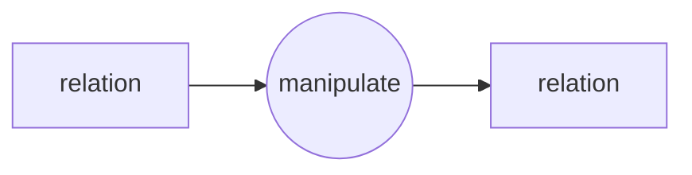
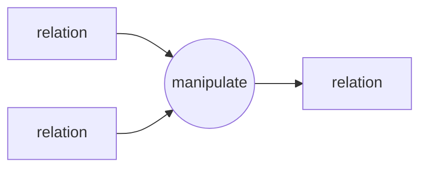
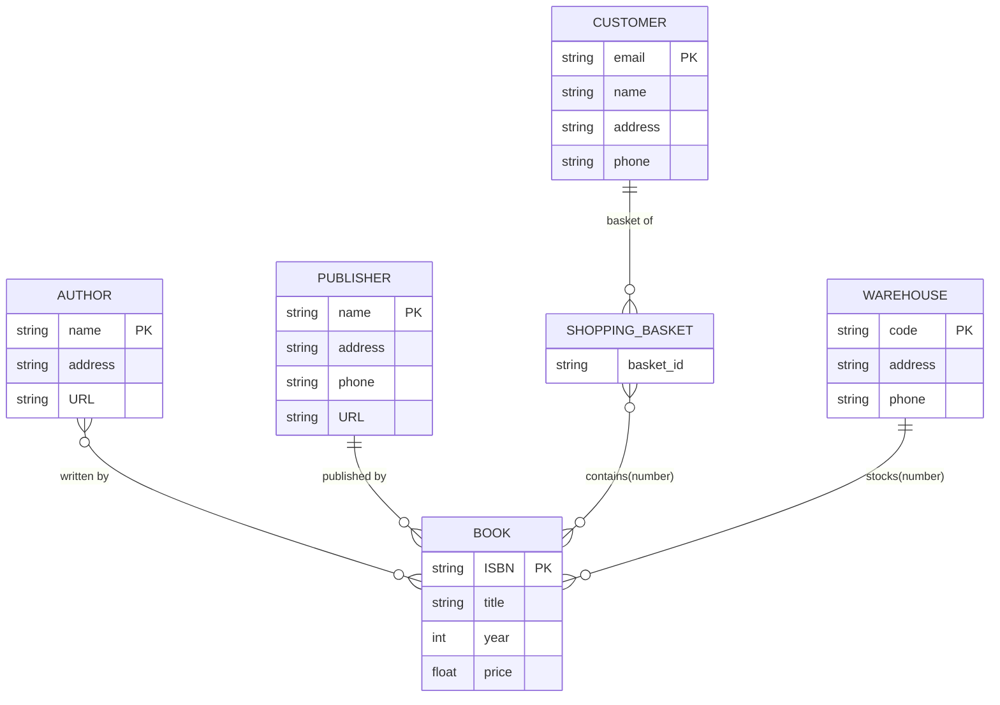
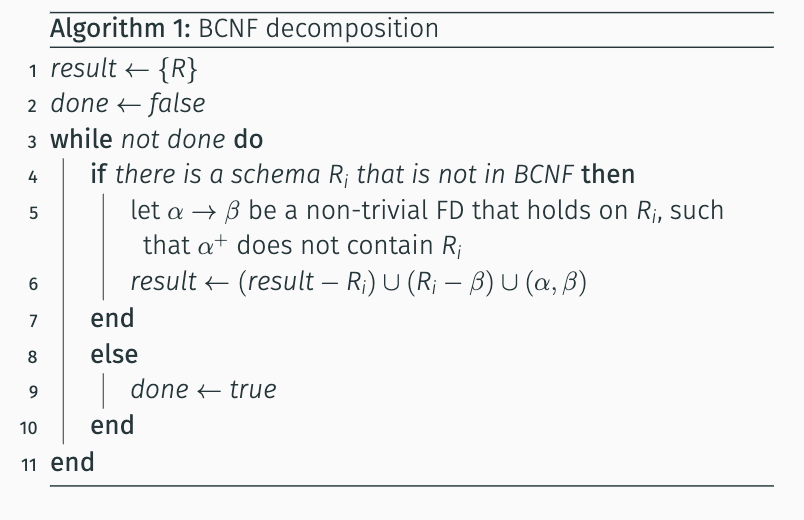

<div align="center">
    <font size="10">
        <b>
            SWUFE Database 2024-2025-2
        </b>
    </font>
</div>

# 1. Introduction

## 1.1. What is database

**base**: the main place where a person lives and works, or a place that a company does business from.

**database**: A database is an organized collection of data stored and accessed electronically from a computer

**DBMS**: A database-management system (DBMS) is a collection of interrelated data and a set of programs to access those data

**two base goal for a DBMS**: convenient and efficient

## 1.2. database application

- E-commerce
- Enterprise Organizations
- Standalone Application: SQLite

### 1.2.1. application categories

- online transaction processing
  - low delay
- data analysis
  - e.g. beers and diapers

## 1.3. Role of the database

In other words, why file-based database is not as good as expected?

- **File processing system's disadvantage**
  - **data redundancy and inconsistency**
    - Data redundancy means higher storage costs, and multiple copies of the same data can lead to data inconsistencies.
  - **data isolation**
    - The data is scattered in different files and may also use different formats. Therefore, it is difficult to write new programs to access the data.
  - **difficulty in accessing data**
  - **integrity problem**
    - Certain values may be subject to certain constraints. For example, salary > 0. Although it is possible to implement the constraint by adding code to the program, it is not flexible enough. For example, new constraints may be added.
  - **concurrent-access anomalies**
    - Assuming you have $100,000 in your account and two expenditures at the same moment ($10,000 and $20,000 respectively), the final result may be incorrect ($90,000 or $80,000).
  - **atomicity problems**
    - You are in the process of making a payment and the system crashes, at this point it may appear that your money is deducted but the object is not received

==Keep in mind the trade-off concept: a file-processing system and a database system (DBMS) are not completely opposed to each other; use the right system for the right situation.==

- When to use DBMS
  - highly valuable
  - relatively Larger
  - accessed by multiple users and applications

## 1.4. view of data

- Abstraction: help you to Ignore irrelevant details


- data model: A collection of conceptualization tools that describe data, data relationships, data semantics, and consistency constraints.
  - relational model: table is relation $\leftarrow$  ==Most commonly used models==
    
  - entity-relationship model: the (E-R) data model uses a collection of basic objects, called entities, and relationships among these objects. $\leftarrow$ ==Widely used in database design==.
  - semi-structured data model: individual data items of the same type may have different sets of attributes. $\leftarrow$ ==Widely used in internet and big data scenarios==
  - object-based data model
  - network model/ hierarchy model

- schema and instance
  - schema: The overall design of the database (translated as "綱要" in Taiwan) can be categorized into physical schema, logical schema, and sub-schema according to the different levels of data abstraction.
  - Instance: A collection of information stored in the database at a specific moment in time.

## 1.5. database language

The database system provides:

- data-definition language: defines the database schema
- data-manipulation language: expresses database queries and updates.

SQL (Structured Query Language) is the current mainstream. It is a declarative language, i.e., it focuses on What, not How.

- DDL: Defines database structure (e.g., CREATE, ALTER, DROP).
- DML: Manipulates data within the database (e.g., SELECT, INSERT, UPDATE, DELETE).

## 1.6. Database System Architecture

too complex to understand, and meaningless as well.


- Tips：
  
- It's silly to connect a database system directly to an application like this on the left


# 2. Relational model

consists of a collection of tables

- Relation:
  - Given sets X and Y , the Cartesian product $X \times Y$ is defined as $\{(x,y)| x\in X , y \in Y\}$ and its elements called ordered pairs
  - A binary relation R over sets X and Y is a subset of $X \times  Y$.

## 2.1. the structure of relational model

|  database | Excel  |
| :-------: | ------ |
|  relation | table  |
|   tuple   | row    |
| attribute | column |

**A row in a table represents a relationship among a set of values.**


**The tuples here are not in order, but can be repeated**

## 2.2. relation schema

- database schema: Logical design of the database
- database instance: A snapshot of the data in the database at a given moment

Similarly, there is a relation schema and a relation instance.

- relation schema: The name of a relation and the set of attributes for a relation
  - e.g. The relation schema of this table
    
    is `instructor(ID, name, dept_name, salary)`

_**all schema during this course can check in  [reference/schema.pdf](reference/schema.pdf)**_


# 3. key

A way to **distinguish** between **different tuples** in a given relation.

- super key: A collection of **one or more attributes**, such that the combination of attributes allows us to **uniquely identify** a tuple in a relation.
  
- candidate key: Its true subset cannot form a super key of a super key (also called "minimal super key").
  - Also not unique
- primary key: Candidate key that is selected by the database designer.
  - use `underline` to identify
  - _**atomicity**_
- foreign key:
  - e.g. Attribute `dept_name` is a **foreign key** from instructor, **referencing** department.
    instructor(ID, name, dept_name, salary);
    department(dept_name, building, budget)
  - referencing relation and referenced relation
  - **Note: The foreign key does not necessarily have the same name as the primary key to which it is referentially related.**


# 4. relation algebra

> Relational algebra is the theoretical foundation of SQL

Relational algebra is defined over`  relations, tuples and attributes. `





Operations are applied either to a single relation or to two relations**.The result is always a single relation.**

## 4.1. SELECT


e.g1: Select all teachers whose `dept_name` is `Physics`.

$$
\sigma_{dept\_name=\text{"physics"}}(\text{instructor})
$$

e.g2: Select all teachers with `salary greater than 90000'.

$$
\sigma_{salary>90000}(\text{instructor})
$$

Comparison operations on predicates (predicate) can use the symbols: $>, <, =, \geq,\leq,\neq$.In addition, multiple predicates can be combined by `logical connectives`:

- and: $\land$
- or:  $\lor$
- not: $\neg$

e.g3: Select all teachers in the Physics Academy with a salary greater than 90000.

$$
\sigma_{\text{physics}=\text{"Physics"} \land \text{salary >90000}}(\text{instructor})
$$

## 4.2. PROJECT

e.g1: Returns the name, dept_name, and salary of all teachers.

$$
\Pi_{\text{ID,dept\_name,salary}}(\text{instructor})
$$

- select($\sigma$) : Intercepts relationships horizontally, affecting [line].
- project($\Pi$) : Intercepts relationships vertically, affects [columns].

Moreover, the generic projection operation allows simple arithmetic on attributes:

$$
\Pi_{\text{ID,dept\_name,salary/12}}(\text{instructor})
$$

## 4.3. Combination of relational operations

e.g4: Find the`  names ` of `all Physics` faculty members.

$$
\Pi_{name}\left(\sigma_{dept\_name}=\text{"Physics"}\left(\text{instructor}\right)\right)
$$

e.g5: Find information on all faculty members belonging to the ` Physics' or  `Chemistry' department.

$$
\sigma_{dept\_name=\text{"Physics"} \lor \text{dept\_name="Chemistry"}}(\text{instructor})
$$

e.g6: Find name and salary of the teacher with ID 10101

$$
\Pi_{\text{name,salary}}(\sigma_{\text{ID=10101}})(instructor)
$$

## 4.4. Cartesian product

$$
A \times B = \{(a,b):a\in A,b\in B \}
$$

- instructor(ID, name, dept_name, salary)
- teaches(ID, course_id, sec_id, semester, year)
- The schema of r = instructor $\times$ teaches ： r(instructor.ID, name, dept_name, salary, teaches.ID, course_id, sec_id, semester, year)


Find information about all the teachers and their classes:

### 4.4.1. JOIN

JOIN is a combination of Cartesian product and selection:

$$
\text{instructor}  \bowtie_{\text{ intructor.ID=teaches.ID}}\text{teaches}
$$

- natural join

If the $\theta$ condition is that **attribute values of the same name are equal**, it can be omitted .In this case, it is called a `natural join`.

$$
\text{instructor} \bowtie  \text{teaches}
$$

## 4.5. UNION, INTERSECT, DIFFERENCE

e.g. section(course_id, sec_id, semester, year, building, room_number, time_slot_id); Find all courses that are in both the Fall 2017 semester and Spring 2018 semester

$$
\Pi_{\text{course\_id}}(\sigma_{\text{semester="Fail"}\land \text{year=2017}}(\text{section})) \cap\Pi_{\text{course\_id}}(\sigma_{\text{semester="Fail"}\land \text{year=2018}}(\text{section}))
$$

_**The precondition for two relations to perform the parallelism operation is that they are ==compatible==, i.e., the two relations have the==same arity== and each corresponding attribute is of the ==same type==.**_

e.g. Find the names of all employees with a salary greater than $10,000

- employee($\underline{\text{ID}}$, person_name, street, city)
- works($\underline{\text{ID}}$, company_name, salary)
- company($\underline{\text{company\_name}}$, city)

$$
\Pi_{\text{person\_name}}(\sigma_{\text{salary>10000}}(\text{works} \bowtie \text{employee}))
$$


# 5. Introduction to SQL

SQL: Structured Query Language

> SQL is a domain-specific language used in programming and designed for managing data held in a RDBMS.

## 5.1. SQL:DDL(Data definition language)

The DDL provides the Define/Modify Relationship Schema and Delete Relationship commands.

### 5.1.1. fundamental data type

| form    | typology                | clarification                                                                                                                 |
| ------- | ----------------------- | ----------------------------------------------------------------------------------------------------------------------------- |
| Numeric | `int`                   | Integer type (machine related, equivalent to `integer`)                                                                       |
|         | `smallint`              | Small-range Integer (subset of int)                                                                                           |
|         | `numeric(p,d)`          | Fixed point numbers, (at most) with p digits and d digits to the right of the decimal point (equivalent to`  decimal ` in PG) |
|         | `float(n)`              | Floating point numbers with at least n (binary) bits of precision.                                                            |
|         | `real/double precision` | Floating-point and double-precision floating-point numbers (8/16-bit significant figures)                                     |
| String  | `char(n)`               | Fixed length string of length n (equivalent to`  charater `)                                                                  |
|         | `varchar`               | Variable-length strings up to n (equivalent to `character varying`).                                                          |
|         | `text`                  | Non-SQL standard, represents strings of arbitrary length.                                                                     |
|         | `null`                  | Each datatype may contain a special value called null, which indicates a missing value: may exist but unknown / may not exist |
| notes：  |                         |                                                                                                                               |

- float(1) to float(24)：real
- float/float(25) to float(53)：double precision

| Name             | Storage Size | Range                       |
| ---------------- | ------------ | --------------------------- |
| smallint         | 2 bytes      | -32768 to +32767            |
| integer          | 4 bytes      | -2147483648 to +2147483647  |
| real             | 4 bytes      | 6 decimal digits precision  |
| double precision | 8 bytes      | 15 decimal digits precision |

### 5.1.2. Advanced data type

#### 5.1.2.1. datetime

Three datatypes related to dates and practices

- `date`: date (4 digits), used to represent **a year, a month, a day**.
- `time`: the time of day, used to represent **minutes, hours, and seconds**; the number of decimal places in seconds can also be specified, `time(p)`
- `timestamp`: a combination of date and time.Similarly, there is a variant `timestamp(p)`. time and timestamp can further specify time zones.

Time-dependent functions

```
SELECT current_date, current_time, current_timestamp;

SELECT current_time at time zone 'CCT'; 
SELECT current_time at time zone 'Asia/Shanghai'; 

SELECT CAST('2008-08-08' AS date); 
SELECT date '2008/08/08';
```

You can also use `interval` to indicate a time interval

```sql
SELECT date '2008-08-08' + interval '1-1'; 
SELECT time '08:30' + interval '2 hours'; 
SELECT time '08:30' + interval '02:00';
```

`extract()` function: Extract specific fields from a given timestamp or interval

```sql
EXTRACT (field FROM source)

-- PG, MySQL, Oracle
SELECT EXTRACT(year FROM timestamp '2008-08-08'); 
-- SQL Server 
SELECT YEAR('2008-08-08');
```

#### 5.1.2.2. serial

There are scenarios where you want the id to be self-incrementing, so you can use serial (similarly, smallserial and bigserial).

#### 5.1.2.3. more types

Information on the position of a point in space point

```sql
CREATE TABLE city( 
	name varchar(20) PRIMARY KEY, 
	location point 
); 

INSERT INTO city VALUES ('Chengdu', '(30.5723, 104.0665)');
```

#### 5.1.2.4. Customized Data Types

```sql
CREATE TYPE RMB 
AS numeric(8, 2); 

CREATE TABLE product( 
	id serial PRIMARY KEY,
	price RMB
);
```

### 5.1.3. type transformation

standard grammar: `cast(e as t)` denotes the transformation of `expression e` into `type t`

In pg, can use `::` to accomplish it

```sql
SELECT '3.14'::DECIMAL;
```

`to_xxx()`:

```sql
SELECT to_date('08-07 2022', 'MM-DD YYYY');
SELECT to_date('22-08-07', 'YY-MM-DD'); 

SELECT to_char(42, '00999'); 
SELECT to_char(123, '00999');
```

### 5.1.4. Basic Schema Definition

```sql
create table department
(
dept_name varchar(20), 
building varchar(15), 
budget numeric(12, 2),
primary key (dept_name)
);
```


```SQL
CREATE TABLE database_name
(
	A1 D1,
	A2 D2,
	...,
	An Dn,
	[integerity-constraint 1]
	...,
	[integerity-constraint k]
);
```

example on integrity constraint:

```sql
1. PRIMARY KEY (...)
2. FOREIGN KEY  (...)  REFERENCES other_database_name
```

### 5.1.5. Delete

- Delete table

```sQL
drop table r;
```

- Delete table but remain itself

```sQL
delete from r;
```

_**Relationship names, attribute names, and keywords are not case sensitive, but keywords are generally capitalized.**_

e.g.

```sql
CREATE TABLE product
(
ID char(20)
price numeric(8,2),
name char(50),
sell_num int,
description varchar(100),
PRIMARY KEY (ID)
);
```

### 5.1.6. Alter table

#### 5.1.6.1. Add new attribute

use `add column A D`

```sql
ALTER TABLE products  
    ADD COLUMN description text;
```

#### 5.1.6.2. Delete attribute

use `drop column A`

```sql
  ALTER TABLE products  
    DROP COLUMN description;
```

Note that you cannot delete directly if it is a primary key or an foreign key application with other relationships.

```sql
-- Cascade Deletion  
ALTER TABLE products  
    DROP COLUMN description CASCADE;
```

#### 5.1.6.3. Others

```sql
-- Modify the data type of an attribute  
ALTER TABLE products  
    ALTER COLUMN price TYPE numeric(10, 2); -- Modify the attribute name.  
-- Modify the attribute name  
ALTER TABLE products  
    RENAME COLUMN product_no TO product_number; -- Modify the attribute name.  
-- Modify the relationship name.  
ALTER TABLE products  
    RENAME TO items; -- modify relationship name
```

### 5.1.7. Default value and more integrity constraints

#### 5.1.7.1. Default Value

If the default value is not explicitly given, then it will be `NULL`

```sql
CREATE TABLE products  
(  
    product_no integer,  
    name       text,  
    price      numeric DEFAULT 9.99  
);
```

Then, it can use in `insert`

```sql
INSERT INTO products (product_no, name)  
VALUES (88, 'Apple');  
  
INSERT INTO products  
VALUES (88, 'Apple', DEFAULT);
```

#### 5.1.7.2. Modify default value

```sql
ALTER TABLE products  
    ALTER COLUMN price SET DEFAULT 8.88;  
    
-- Clear Defaults  
ALTER TABLE products  
    ALTER COLUMN price DROP DEFAULT;
```

#### 5.1.7.3. integrity constraints

##### 5.1.7.3.1. unique

Integrity constraints ensure that changes made to the database by the user do not disrupt the consistency of the data.

```sql
CREATE TABLE products  
(  
    product_no integer UNIQUE, -- line constraint  
    name       text,  
    price      numeric  
);  

CREATE TABLE products  
(  
    product_no integer,  
    name       text,  
    price      numeric,  
    UNIQUE (product_no) -- table constraint  
);
```

##### 5.1.7.3.2. check

The check(P) clause specifies a predicate that must be satisfied by P for each tuple in the relation.

```sql
CREATE TABLE products  
(  
    product_no integer,  
    name       text,  
    price      numeric CHECK (price > 0)  
);  

CREATE TABLE products  
(  
    product_no       integer,  
    name             text,  
    price            numeric,  
    CHECK (price > 0),  
    discounted_price numeric,  
    CHECK (discounted_price > 0),  
    CHECK (price > discounted_price)  
);

CREATE TABLE products  
(  
    product_no integer,  
    name       text,  
    price      numeric CHECK (price > 0)  
);
```

## 5.2. SQL:DML (Data Manipulation Language)

### 5.2.1. Basic Query Structure

The basic SQL query structure consists of 3 clauses: `SELECT, FROM, WHERE`.

```sql
SELECT A1, A2 , ... , An
FROM r1, r2, ... , rm
WHERE p;
```

- $\Pi_{\text{name}}(\text{instructor})$

```sql
SELECT name FROM instructor 
```

- duplicate

```sql
SELECT DISTINCT dept_name FROM instructor
```

- $\Pi_{\text{name,salary/12}}(\text{instructor})$

```sql
SELECT name, salary/12 FROM instructor 
```

- The `where` clause selects a tuple that satisfies a condition by means of a predicate; `and, or, not` can be used between predicates.
  $$
  \Pi_{\text{name}}(\sigma_{\text{dept\_name="Phtsics" } \land \text{salary>70000}}(\text{intructor}))
  $$

```sql
SELECT name 
FROM instructor
WHERE
	dept_name = 'Physics'
	and
	salary>70000;
```

- not equal ：`<> / !=`

```sql
SELECT name FROM instructor
WHERE dept_name !='Physics';

SELECT name FROM instructor
WHERE dept_name <>'Physics';
```

- between

```sQL
SELECT name FROM instructor
WHERE salary BETWEEN 90000 AND 100000;
```

- line constructor

```sql
SELECT course_id FROM section
WHERE (semester,year) = ('Spring' , 2018 );
```

- Multi Table Query

```sql
SELECT name, instructor.dept_name, building
FROM insturctor, department 
WHERE instructor.dept_name=department.dept_name 
```

```sql
SELECT name, course_id
FROM instructor i , teaches t
WHERE 
	i.ID = t.ID
	AND 
	dept_name='Computer';
```

- Rename

$$
\rho_{X}(E)
$$

```sql
SELECT name AS teacher FROM instructor;
```

- `*` : asterisk

```sql
SELECT  * FROM instructor  
```

- order (ascending by default)

```sql
SELECT *
FROM instructor
ORDER BY salary DESC , name ASC
```

### 5.2.2. string function

- some string function
  - lower() / upper()
  - trim(): `trim('  SWUFE   ')='SWUFE'`
  - length()
  - put together：
    - mysql:concat/ group_concat
    - sql server: +
    - pg: || /  string_agg
  - fuzzy query `LIKE`
    - % : Match any **string**
    - _ ：Match any **character**
      e.g.
      abc' LIKE 'abc' : True
      'abc' LIKE 'a%' : True
      'abc' LIKE '_b_' : True
      'abc' LIKE 'c' : False
    - Escape characters: when you need to match `%, \, _` in a string: all preceded by `\` escape.
  - ELSE：
    - [1]<https://www.postgresql.org/docs/14/functions-string.html>
    - [2]<https://www.postgresql.org/docs/14/functions-matching.html>

### 5.2.3. set operation

- UNION
- INTERSECT
- EXCEPT

### 5.2.4. case

```sql
SELECT  somecolumns,
       CASE  
           WHEN condition1 THEN result1  
           WHEN condition2 THEN result2  
           WHEN conditionn THEN resultn  
           ELSE result  
           END  
FROM somewhere
```

### 5.2.5. NULL

NULL: Missing value

#### 5.2.5.1. arithmetic operations

The result of an arithmetic expression (e.g., + - * /) is null if either input to the expression is null.


#### 5.2.5.2. Comparison of null values

Consider Boolean: ` true, false, unknown  `(this is the logical state, but will show up as NULL)
_**Neither false nor unknown will appear in the results.**_
![[attachments/Pasted image 20250327184751.png]]
In other words, It's unselectable in almost every cases

#### 5.2.5.3. test null

`IS NULL`

### 5.2.6. Aggregate Functions

e.g.:

- max
- min
- avg
- count Cannot have `count(distinct *)` , and will count NULL fields
- sum

_**Aggregate functions are not allowed in `WHERE` clauses, except with `subqueries`**_

#### 5.2.6.1. Aggregate by groups

use `GROUP BY`

#### 5.2.6.2. Having()

If you need to qualify a grouping, such as "average salary exceeds $42,000", you cannot use the where clause, but need to use the having clause.

Must be used in conjunction with `GROUP BY`, otherwise not legal

### 5.2.7. Order of execution

- First compute a relation based on the `from` clause.
- If there is a `where`, apply the `where` predicate to the relationship.
- If there is a `group by`, form a group based on the above result. If not, the entire set of tuples is treated as a group by.
- If `having` is present, it will be applied to each group; groups that do not satisfy the predicate `having` will be discarded.
- `select` uses the remaining groupings to produce the tuples in the query result

### 5.2.8. Sub-Queries

`select-from-where` is nested in another query

#### 5.2.8.1. set membership

To test whether a tuple is in an enumerated set, use the conjunction `IN`, usually used in a set generated by `SELECT

#### 5.2.8.2. scalar sub-query

Returns only **a single element** with a single attribute that can appear anywhere

### 5.2.9. Comparison of sets

- **at least bigger than one** :with `>some`

```sql
SELECT name
FROM instructor
WHERE
    salary > SOME (
        SELECT salary
        FROM instructor
        WHERE
            dept_name = 'History'
    );
-- Can also be expressed as "greater than minimum"
SELECT name
FROM instructor
WHERE
    salary > (
        SELECT min(salary)
        FROM instructor
        WHERE
            dept_name = 'History'
    );
```

You can replace`  some ` with `any`

| ALL PARA    | ALL PARA                   |
| ----------- | -------------------------- |
| <some       | $\ge$ some                 |
| $\le$  some | =some $\Leftrightarrow$ in |
| > some      | <>some                     |

- **Bigger than all** with `> all`.

### 5.2.10. Empty Relationship Test

Use `select` to test if the relationship returned by a subquery is empty

### 5.2.11. WITH()

The `with` statement defines a temporary relationship to be used for the current query.
e.g.

```sql
WITH max_buedget(value) AS (SELECT MAX(budget) FROM department)  
SELECT budget  
FROM department,  
     max_buedget  
WHERE department.budget = max_buedget.value;
```

## 5.3. SQL: CHANGE

### 5.3.1. DELETE

```sql
DELETE FROM r
WHERE p
```

Notice that `delete` only deletes the content reservation table, while `drop` deletes the entire table

### 5.3.2. INSERT

```sql
-- Order by attribute list (not recommended) 
INSERT INTO course
VALUES ('CS-205', 'Database Systems', 'Comp. Sci.', 4); -- Specify attributes (not in DDL attribute order).
-- Specify attributes (not in DDL attribute order) 
INSERT INTO course(course_id, title, dept_name, credits)
VALUES ('CS-205', 'Database Systems', 'Comp. Sci.', 4); -- Specify attributes (not in DDL attribute order).
```

It is also possible to insert a collection of tuples, or partial attributes (remaining null by default), the
It is also possible to insert the result of a query
or quickly import them via COPY, etc.

### 5.3.3. UPDATE

```sql
UPDATE table
SET attribute = p   -- p can also be CASE(...)
```

## 5.4. SQL: Window function

### 5.4.1. RANK()

Be careful to exclude `NULL` values when sorting
e.g.

```sql
SELECT id  
FROM (SELECT id, RANK() OVER (ORDER BY salary DESC NULLS LAST) AS s_rank FROM instructor) AS a  
WHERE s_rank = 1;
```


# 6. Intermediate SQL--JOIN

A query that accesses multiple rows of the same or different tables at one time is called a join query.
'

## 6.1. Natural JOIN

```sql
SELECT name, course_id  
FROM student,  
     takes  
WHERE student.id = takes.id;  

-- The same as:
SELECT name, course_id  
FROM student  
         NATURAL JOIN takes;
```

Multi natural join

```sql
SELECT a1, a2, ..., An  
FROM r1 NATURAL JOIN r2 NATURAL JOIN. . . NATURAL JOIN rm  
WHERE P;
```

### 6.1.1. Outer JOIN

You can include null in the result without losing data


# 7. Advanced SQL

## 7.1. View

### 7.1.1. Define a View

Virtual relationship, only information is retained, not stored or

```sql
create view v 
as 
<query-expression>
```

### 7.1.2. use a view

Views are not pre-computed and stored, but are re-computed by executing queries when virtual relationships are used.
In terms of SQL query syntax, there is no difference between a "view" and a normal "relationship".
Some databases allow views to be stored and ensure that if a relationship changes, the corresponding view is updated.Such a view is called a materialized view.


## 7.2. authorization

In other words, Define access rights (privilege)

### 7.2.1. authorization

Read, insert, update, delete
`GRANT <authority list> ON <relationship or view> TO <user or role>`

```sql
GRANT SELECT 
ON department
TO LiLei

```

### 7.2.2. Role

in PG, it consistently use of role for users and groups

steps:

1. create role : `CREATE ROLE lilei WITH LOGIN PASSWORD '123456';`
2. authorize: `GRANT SELECT ON department TO lilei;`

then it can use `SELECT` query.

## 7.3. Functions and procedures

### 7.3.1. Define a function

SQL itself contains default functions such as the AVG() function.

```sql
SELECT AVG(salary)
FROM instructor
GROUP BY length(name);
```

But we can custom new function:

```sql
CREATE FUNCTION
add(integer,integer) RETURNS integer 
AS 'select $1+$2;'
LANGUAGE SQL;


-- Advanced way
CREATE FUNCTION multiply(i integer, j integer)
RETURNS integer AS
$$
BEGIN
	RETURN i*j;
END;
$$
LANGUAGE plpgsql;
```

### 7.3.2. Define a procedure

In the real world an action often involves multiple reads and writes to the database. For example, when placing an order on Taobao, the database needs to 1) add the order and 2) add the delivery information.

```sql
CREATE PROCEDURE 
	buy(id varchar(50), product text, address text) 
AS $$ 
	INSERT INTO order(id, product) VALUES($1, $2); 
	INSERT INTO deliver VALUES($2, $3); 
	$$ 
LANGUAGE SQL;
```

## 7.4. Trigger

A trigger is a statement that the system executes automatically as a side effect of a modification to the database.

To define a trigger, we must:

- Specify when a trigger is to be executed. This is broken up into an event that causes the trigger to be checked and a condition that must be satisfied for trigger execution to proceed.
- Specify the actions to be taken when the trigger executes.

### 7.4.1. When to use

Triggers can be used to implement certain integrity constraints that cannot be specified using the constraint mechanism of SQL . Triggers are also useful mechanisms for alerting humans or for starting certain tasks automatically when certain conditions are met.

Example：we could design a trigger that, whenever a tuple is inserted into the takes relation, updates the tuple in the student relation for the student taking the course by adding the number of credits for the course to the student’s total credits

Note: triggers usually cannot be used outside the database


## 7.5. Accessing databases using a programming language

### 7.5.1. background knowledge

B-S framework(Browser/Server framework)
e.g.: jdbc:postgresql :// localhost : 5432 / mydb $\leftrightarrow$ Protocol:// Server: port/...

### 7.5.2. Python Accessing the Database

in python, recommend `psycopg2`

### 7.5.3. ORM

However, embedding SQL code directly inside a program can be a nightmare for large projects.

- SQL code cannot be verified to be correct at compile time
- Cannot mask differences between DBMSs

to solve, object-relational mapping is now  widely used

Though it is Oracle, MySQL, pg can also use sqlalchemy one of the most popular ORM framework

```python
import oracledb
import pandas as pd
from sqlalchemy import create_engine

# Initialize the Oracle client
oracledb.init_oracle_client(lib_dir=r"E:\app\username\product\11.2.0\dbhome_1\bin")

# Connection parameters
username = "SYSTEM"
password = 
host = "localhost"
port = "1522"
service_name = "orcl"

# create  SQLAlchemy engine
connection_string = f"oracle+oracledb://{username}:{password}@{host}:{port}/?service_name={service_name}"
engine = create_engine(connection_string)


#  query
# query = ""
# df = pd.read_sql(query, con=engine)
```

<https://github.com/ChenZhongPu/db-swufe/blob/master/10_advanced/python-orm/main-orm.py>

## 7.6. SQL Injection

<https://www.youtube.com/watch?v=wcaiKgQU6VE>

SQL statements constructed using simple string concatenation run the risk of SQL injection, but you can avoid this problem by using ORM or PreparedStatement.

If the logic for user login is `SELECT * FROM users WHERE name = '{name}' AND pswd = '{pswd}'`, then all the

```sql
SELECT * FROM users WHERE name='zhongpu' AND pswd='' or '1'='1';

SELECT * FROM users WHERE name='zhongpu' AND pswd='' or 1='1';
```

are eternal for TRUE statements can go directly to the database

To prevent SQL injection, you should use the parameterized query or prepared statement. This ensures that user input is processed correctly and not embedded directly into the SQL statement:
e.g.：

```python
import sqlite3

conn = sqlite3.connect('example.db')
cursor = conn.cursor()

# Use of parameterized queries
cursor.execute("SELECT * FROM users WHERE name = ? AND pswd = ?", (name, pswd))

```


# 8. ER model

ER model : entity-relationship model

## 8.1. entity and entity set

An entity is a "thing" or "object" that can be distinguished from all other objects in the real world. An entity set is a collection of entities of the same type.


## 8.2. relationship and relationship set

A relationship is an interconnection between multiple entities. A relationship set is a collection of the same type of relationship.


## 8.3. E-R figure

e,g,


## 8.4. Attribute

### 8.4.1. domain

For each attribute, there is a set of allowable values called a domain.

### 8.4.2. category

According to different criteria, it can be divided into:

- simple attributes: not subdividable; composite attributes: can be subdivided into smaller parts (or other attributes);
- single-valued attributes; multi-valued attributes.

Question:
Atomicity of attributes requires that each component of a relationship must be an indivisible data item, i.e., no tables are allowed in tables. So why are composite and multi-valued attributes allowed in E-R diagrams?

Answer:
The primary purpose of the E-R model is conceptualization and design phase representation to help designers `understand and capture data requirements`. It is `not directly used` for database implementation. In the actual database implementation phase, designers need to convert composite and multi-valued attributes into a structure that conforms to the relational model, usually by ` creating new tables  `and `using foreign keys`.

## 8.5. mapping cardinality

The mapping cardinality represents the number of entities that an entity can be associated with through a contact set.
For example, the mapping cardinality is used to represent: How many students can a teacher instruct? How many students can be taught by one teacher?


As you can see, the arrow is pointing to the 'one' side

### 8.5.1. cardinality constraints

The constraint can be expressed as a pair number `min...max`


Each teacher has exactly one student and each student is instructed by 0 to more than one teacher

The 'full' participation of an entity is indicated using `two lines`:


The E-R diagram above indicates that each student has a mentor.

## 8.6. Primary key

Similar to relationships, the E-R model has the concept of a master code, which is used to uniquely identify an entity or link.

### 8.6.1. Entity Sets

Can be migrated directly from the primary key concept in the relational schema

### 8.6.2. Relationship Sets

Let $R$ be a relationship set involving entity sets $E_1 , E_2 , \dots , E_n$. Let PK($E_i$) denote the set of attributes that forms the primary key for entity set $E_i$.
Then the superkey for the relationship set is

$$
PK(E_{1)} \cup PK(E_{2)}\cup \cdots \cup PK(E_n)
$$

The choice of the primary key for a binary relationship set depends on the mapping cardinality of the relationship set.
Take the E-R diagram for insturctor and student as an example

- For many-to-many relationships, the preceding union of the primary keys is a minimal superkey and is chosen as the primary key.The primary key of advisor consists of the union of the primary keys of instructor and student.
- For one-to-many and many-to-one relationships, the primary key of the “many” side is a minimal superkey and is used as the primary key.  For example, each student can have at most one advisor—then the primary key of advisor is simply the primary key of student.
- For one-to-one relationships, the primary key of either one of the participating entity sets forms a minimal superkey, and either one can be chosen as the primary key of the relationship set.

### 8.6.3. Weak Entity Sets

Consider section, which depends on another entity for its existence; we call such an entity a weak entity set.


The primary key  of a weak entity set consists of the primary key of the identifying entity set plus the discriminator of the weak entity set.

### 8.6.4. Removing Redundant Attributes in Entity Sets

a good entity-relationship design does not contain redundant attribute

## 8.7. Reducing E-R Diagrams to Relational Schemas

### 8.7.1. Strong entity sets with simple properties

### 8.7.2. Representation of Strong Entity Set

It is easy.


### 8.7.3. Representation of Strong Entity Sets with Complex Attributes


```SQL
instructor(ID, first_name, middle_name, last_name, salary, date_of_birth) 

instructor_phone(ID, phone_number)
```

### 8.7.4. Representation of Weak Entity Set

Let $A$ be a weak entity set with attributes $a_1 , a_2 , \dots , a_m$. Let B be the strong entity set on which A depends. Let the primary key of $B$ consist of attributes $b_1 , b_2 , \dots , b_n$. We represent the entity set A by a relation schema called A with one attribute for each member of the set:

$$
\{a_1 , a_2 , \dots , a_m\} \cup \{b_1 , b_2 , \dots , b_{n}\}
$$


### 8.7.5. Representation of Relationship Sets

Let R be a relationship set, let $a_1 , a_2 , \dots , a_m$ be the set of attributes formed by the union of the primary keys of each of the entity sets participating in R, and let the descriptive attributes (if any) of R be $b_1 , b_2 , \dots , b_n$. We represent this relationship set by a relation schema called R with one attribute for each member of the set:

$$
\{a_1 , a_2 , \dots , a_m\} \cup \{b_1 , b_2 , \dots , b_{n}\}
$$


### 8.7.6. Redundancy of Schemas

In general, the schema for the relationship set linking a weak entity set to its corresponding strong entity set is redundant and does not need to be present in a relational database design based upon an E-R diagram.

### 8.7.7. Combination of Schemas

A Many-to-One link allows entities on the side of the link and Many to be merged.

## 8.8. Example

Here is an simple example of a library management system, there are sth different in Mermaid, but it is easy to get, while the 'O' represents the allowable NULL value



![[attachments/Pasted image 20250522191013.png]]


# 9. The relational database good form

WHY a small schema rather than big one

- Redundancy
- Poor maintainability

lossless decomposition

$$
\Pi_{R_{1}}(r) \bowtie \Pi_{R_{2}}(r) =r
$$

We say that a relational schema is a "good form", meaning that it has `no information redundancy`. The rationale behind this is to check for conformity to the ` normal form  `and decompose it as `needed`.

## 9.1. First Normal Norm

basic demand for a relational database

Key word: Atomic Non-repeating Unique value

## 9.2. functional dependencies

- attribute set: Greek alphabet
- schema: r(R), where r is relation name, R is attribute list
- super key: K

> Defination
> Consider a relation schema $r(R)$ , place $\alpha \subseteq R$ and $\beta \subseteq$R,
> given an instance of $r(R)$ , we say this instance satisfy functional dependencies $\alpha \rightarrow \beta$ if for all pair of tuple, if $t_{1}[\alpha]=t_{2}[\alpha]$ ,then $t_{1}[\beta]=t_{2}[\beta]$

### 9.2.1. trivial dependancy

> if $\beta \subseteq \alpha$ , then functional dependency $\alpha \rightarrow \beta$ is trivial

### 9.2.2. dependency closure

Since functional dependency can do inference, functional dependency can compose `closure` , and use $F^{+}$ to represent the closure of set F

**If at least one of the following functional dependencies belongs to $F^+$, then $R_1$ and $R_2$ constitute a lossless decomposition of R:

- $R_{1} \cap R_{2} \rightarrow R_{1}$
- $R_{1} \cap R_{2} \rightarrow R_{2}$

## 9.3. Boyce-Codd Normal Form(BCNF)

> A relational schema R with a functional dependency set F belongs to BCNF if, for all functional dependencies in $F^{+}$ of the form $\alpha \rightarrow \beta$, at least one of the following holds:
>
> - $\alpha \rightarrow \beta$ is trivial functional dependency
> - $\alpha$ is one of a super key of R

Example:
Assuming a teacher has multiple addresses, decompose the following relational schema so that it satisfies BCNF.

inst(ID, name, street, city)

| ID    | name | street        | city     |
| ----- | ---- | ------------- | -------- |
| 22222 | Bob  | Liulin        | ChengDu  |
| 22222 | Bob  | Guanghua      | ChengDu  |
| 33333 | Mike | Dongchuan Rd. | Shanghai |

first, ID ->name, then prove not satisfy BCNF
so
IN(ID, name)
and
ins_(ID, street, city)

### 9.3.1. BCNF decomposition algo




# 10. database theory

## 10.1. storage
### 10.1.1. File storage
in DBMS, it organizes the file into a set of pages(A page is a fixed-size block of data.).
4-16KB size.
### 10.1.2. page organization
A DBMS can organize pages in different ways: 
- Heap file organization 
- Tree file organization 
- Sequential file organization 
- Hash file organization

We don't need to know what's inside the page at this point.

#### 10.1.2.1. heap file organization
A heap file is an unordered collection of pages/records with tuples that are stored in random order.

Assuming variable-length records, there may be free space in each Block; when performing an INSERT, how do you know which Block has enough free space?

Most DMBSs maintain a free-space map to keep track of the free space of each Block. A common implementation is to use an array where each element represents the free-space ratio of the corresponding block. For example, in PostgreSQL, each element is a Byte, divided by 256 to get the free-space ratio.


### 10.1.3. Contents of Page
Page consists of header and data, where header is meta-data describing the content of the page: 
- page size 
- checksum 
- DBMS version 
- compression information. 
-  ...

### 10.1.4. Page layout 
#### 10.1.4.1. Fixed-Length Records
Assume that we are only storing tuples in the page. 
If the tuples are fixed-length, the only difficulty is to keep track of the deleted tuples, and one solution is to use a free list.


It is undesirable to move records to occupy the space freed by a deleted record, since doing so requires additional block accesses. Since insertions tend to be more frequent than deletions, it is acceptable to leave open the space occupied by the deleted record and to wait for a subsequent insertion before reusing the space. A simple marker on a deleted record is not sufficient, since it is hard to find this available space when an insertion is being done. Thus, we need to introduce an additional structure:Header 

At the beginning of the file, we allocate a certain number of bytes as a file header. The header will contain a variety of information about the file. For now, all we need to store there is the address of the first record whose contents are deleted. We use this first record to store the address of the second available record, and so on. Intuitively, we can think of these stored addresses as `pointers`, since they point to the location of a record. The deleted records thus form a linked list, which is often referred to as a free list.

#### 10.1.4.2. Variable-Length Records
To represent variable length data, (offset, length) is generally used.


The most common way to store these variable-length tuples is in slotted pages, where a slot array is used to record the position and size of each tuple.


https://www.postgresql.org/docs/current/storage-page-layout.html

### 10.1.5. storage model
The relational model does not require that the DBMS store all the attributes of a tuple in a single page.
- row-storage, also known as n-ary storage model (NSM): The DBMS stores **all the attributes of a tuple contiguously within a page**. 
- column-storage, also known as decomposition storage model (DSM): The DBMS stores **all the single attribute of all tuples contiguously within a page**.


### 10.1.6. large objects storage
Databases often store data much larger than disk blocks, such as the blob and clob types supported by SQL, which store binary and character large objects, respectively. Many databases internally limit the size of records to no more than the block size, but allow records to logically contain large objects by actually storing the large object separately from the other (short) attributes of the record, and by storing a (logical) pointer to the object in the record containing the large object. The large object may be stored as a file in a file system area managed by the database, or as a file structure managed within the database. In the latter case, large objects within the database can optionally be represented using a B⁺-tree file organization to enable efficient access to any location within the object, supporting the reading of the entire object, the specifying of byte ranges, and the insertion and deletion of portions of the object.

### 10.1.7. Metadata
A database has multiple tables, table data is stored in Pages, and multiple Pages are in one file, so when answering SELECT * FROM student, how does the DBMS know which file to query?

Each database maintains a data dictionary that stores the database's metadata.

https://www.postgresql.org/docs/current/limits.html

## 10.2. Index

A database index is a data structure that improves the speed of data retrieval operations on a database table at the cost of additional writes and storage space to maintain the index data structure.

### 10.2.1. category

- ordered index : value based
- hash index

### 10.2.2. ordered index

#### 10.2.2.1. clustering v.s. non-clustering index

If the search code of the index also `determines the order of the records` in the containing file
On the other side, if the index differ from the records, then it will be non-clustering index/secondary index.

The file organization  that clustering index rely on is `sequential file organization`

A table cannot have multiple clustering index, since you can't guarantee that two search codes will exactly match the sorting in the same file, as how clustering is defined

The primary key of the MySQL InnoDB engine is automatically an clustering index; SQL Server supports both; other DBMSs mainly support non-clustering indexes.

#### 10.2.2.2. dense v.s. sparse index

In a dense index, an index entry appears for every search-key value in the file

sparse index cannot be an non-clustering index, because it would throw subsequent indexing out of whack

### 10.2.3. B+ Tree Index

properties:
B+ trees are balanced with heights of order log N; a B+ node is typically within a page (typically 4 KB).

- Each non-leaf node (except the root node) has between n/2 and n children.
- The number of children of the root node is between 2 and n.

practice:
Assuming a pointer of 8 bytes and a search code of 32 bytes, then n is about 100. Assuming 1 million records, then at most one B+ tree node needs to be accessed: 5

### 10.2.4. Hash Index

A hash function is any function that can be used to map data of arbitrary size to fixed-size values

Hash indexes support only = operators, not range queries, as their random nature

Think：Assuming that 1 page (4KB) can hold 100 index entries, then for 100,000,000 tuples, 1,000,000 pages (i.e., 4GB) are needed to hold the index. Given the memory constraints, what should be done?
Build the index based on the index, Multi-level index

## 10.3. Query plan


basic steps:

- parsing: Converting SQL statements to internal representations
- optimization: Generate a query plan
- execution: Execute the query plan

### 10.3.1. query optimization

predicate push down i.e. filter first

e.g.

```sql
 select salary
  from instructor 
  where salary < 75000;
```

`where first,` then select , faster than select first

## 10.4. transaction

The term transaction refers to a collection of operations that form a single logical unit of work.

Properties:(ACID)

- Atomicity
- Consistency
- Isolation
- Durability

### 10.4.1. Atomicity

All operations of a transaction are either executed successfully or the partial effect of each unfinished transaction is undone in the event of a failure.

### 10.4.2. Consistency

Execution of a transaction in isolation (i.e., with no other transaction executing concurrently) preserves the consistency of the database.

（Who owns responsibility: Programmer & some foreign key)

[如何理解数据库事务中的一致性的概念？ - sleep deep的回答 - 知乎](https://www.zhihu.com/question/31346392/answer/569142076)
p.s. Here the meaning of the consistency differs from the consistency in distributed database

### 10.4.3. Isolation

In a database system that allows multiple transactions to execute concurrently, if updates to shared data are not controlled, transactions may see inconsistent intermediate state resulting from updates by other transactions. This situation can lead to incorrect updates to data in the database. Therefore, database systems must provide mechanisms to isolate the effects of one transaction from other concurrently executing transactions.

### 10.4.4. Durability

Once a transaction has been successfully executed, its effects must be persisted in the database-a system failure should not cause the database to forget a successfully completed transaction. This feature is called durability.

### 10.4.5. Transaction isolation level

(trade off consistency and parallelization)

- Serializable: Typically ensures serialized execution of transactions
- Repeatable Read: Allow only committed data to be read, and further require that no other transaction be allowed to update a data item between two reads of that item by a transaction
- Read Commited: Only committed data is allowed to be read, but repeated reads are not guaranteed. For example, between two reads of a data item by the same transaction, another transaction may have updated the data item and committed it. (`Default Isolation Levels for Most DBMSs`)
- Read Uncommited: Allow reading of uncommitted data. It is the lowest level of isolation allowed in SQL.

#### 10.4.5.1. some bad condition

- dirty read: A dirty read is when one transaction (e.g., Transaction A) reads data that another transaction (e.g., Transaction B) has modified but not yet committed.(when B rollback it will screw up)
- Non-Repeatable Read: **An unrepeatable read is when the same row** of data is read multiple times within a transaction, but you get different results.(In between multiple reads by transaction A, another transaction B modifies or deletes the row and commits the changes.)
- Phantom Read: A phantom read is when the same range query (e.g., a query with a WHERE clause) is executed multiple times within a single transaction, but the result set returned by the second query **contains rows that didn't exist** at the time of the first query (or some rows are missing, although the emphasis is usually on the **extra rows**).

### 10.4.6. query logic of the transaction
> This comes from a question I asked in a data engineering interview, but there's no guarantee that the answer here is correct


In SQL, transactions are typically managed using the following keywords:

- BEGIN TRANSACTION: starts a transaction.
- COMMIT: commits the transaction, saving the results of all operations to the database.
- ROLLBACK: Rolls back a transaction, undoing all operations in the transaction.

```sql
BEGIN TRANSACTION;

-- Perform some SQL operations
UPDATE accounts SET balance = balance - 100 WHERE account_id = 1;
UPDATE accounts SET balance = balance + 100 WHERE account_id = 2;

-- Check for errors
IF @@ERROR ! = 0
BEGIN
    -- If there is an error, roll back the transaction
    ROLLBACK.
END
ELSE
BEGIN
    -- If there are no errors, commit the transaction
    COMMIT.
END

```

> BTW, I can share another question, which I am still confused after asking all kinds of AI: Essential Differences between MySQL and PostgreSQL?


# 11. Advanced Database Technology

## 11.1. DuckDB

```bash
brew install duckdb
```

> DuckDB is a fast **analytical, in-process** database system

- Motivation: Existing databases are too cumbersome and costly for data scientists, data analysts, etc. to learn.

- What DuckDB do？ In windows, just a 10MB zip file, and can do almost everything pg,... can do.

- What it focus on? `SELECT`

[see in Wiki](https://en.wikipedia.org/wiki/DuckDB)

### 11.1.1. When to use

For analytical loads:

- Faster than SQLite
- More convenient than PostgreSQL, Spark
- Less resource intensive than Pandas, etc.

Positioning: Efficient Analysis of Data Sets of Several Hundred Gigabytes in Size

### 11.1.2. Some Example

#### 11.1.2.1. Directly using the command line

```bash
> duckdb -s "SELECT COUNT(*) FROM 'data.csv"
```


```bash
> duckdb -csv \
-s "SELECT..." \
"new.csv"

duckdb -s "FROM 'data.csv' LIMIT 5"
```

```bash
> .mode line
> SUMMARIZE FROM 'data.csv';
columns_name = ...
columns_type = ...
.....
null percentage=...
```


```bash

> CREATE TABLE table_name AS SELECT * from 'data.csv';
> DESCRIVE table_name
```

#### 11.1.2.2. WebUI

```bash
duckdb -ui
```


#### 11.1.2.3. in Python:

```bash
pip install duckdb --upgrade
```

- SQL query


- Pandas integration


#### 11.1.2.4. with other relational dababase

through plugin （e.g. `postgres_scanner`) then u can connect PostgreSQL and use its data

### 11.1.3. performance comparison

A 10GB parquet file, read and queried using DuckDB, proved to require only `400MB of memory` and `51s of runtime`. On the contrary, Pandas can't even complete the reading.

## 11.2. Vector Database

with the development of LLM

<https://www.dailydoseofds.com/a-beginner-friendly-and-comprehensive-deep-dive-on-vector-databases/>

### 11.2.1. Introduction

vector(embedings) can transmitting semantic information


> Once stored in a vector database, we can retrieve original objects that are similar to the query we wish to run on our unstructured data.

e.g. in vector database, we have $King + Man - Woman \approx Queen$


> In other words, encoding **unstructured data** allows us to run many sophisticated operations like similarity search, clustering, and classification over it, which otherwise is difficult with traditional databases.

However, it is hard to do it, as u need a full table scan to get it, so you need a model to do the retrieval

### 11.2.2. How to generate embeddings?

Omitted, see blog for details

### 11.2.3. Query a vector database

we need an index, and do **approximate nearest neighbor (ANN)**

#### 11.2.3.1. Flat Index

> Flat index is another name for the **brute-force search** we saw earlier, which is also done by KNN. Thus, all vectors are stored in a single index structure **without any hierarchical organization**.


#### 11.2.3.2. Inverted File Index(IVF/IVFFlat)

Thoughts:

- Partitioning
- Pick a center point (KNN like)
- When a new query comes in and only looks at which center it is closer to, and then retrieves it in the corresponding region


#### 11.2.3.3. Product Quantization(PQ)

> Compressing the data while preserving the original information.

Thoughts

- Create data segments
  each vector has 256-d, and 32bits each, then use 8192bits
  split it into 8, each will be 32-d
  
- run KMeans
  by k-means, we have 8 centroids
  
- encode vectors
  for each segment of a vector in the entire database, we find the nearest centroid from the respective segment
  

#### 11.2.3.4. Hierarchical Navigable Small World (HNSW)

> construct a graph structure, where each node represents a data vector, and edges connect nodes based on their similarity.
> HNSW organizes the graph in such a way that facilitates fast search operations by efficiently navigating through the graph to find approximate nearest neighbors.


