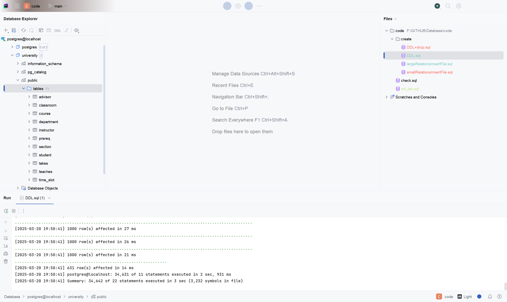
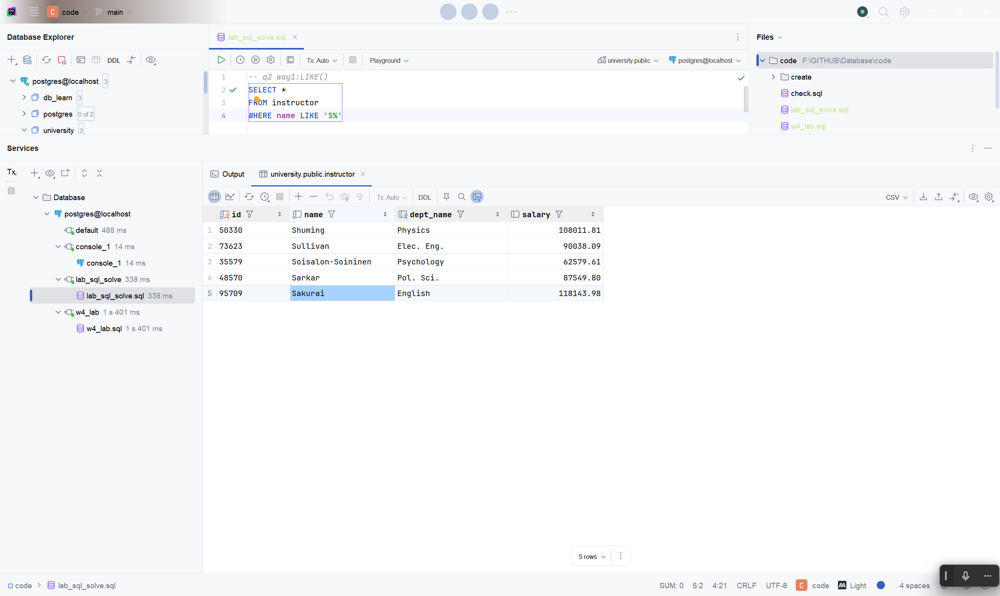
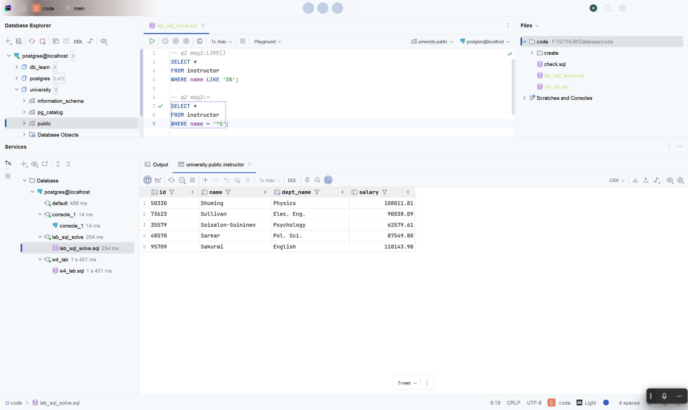
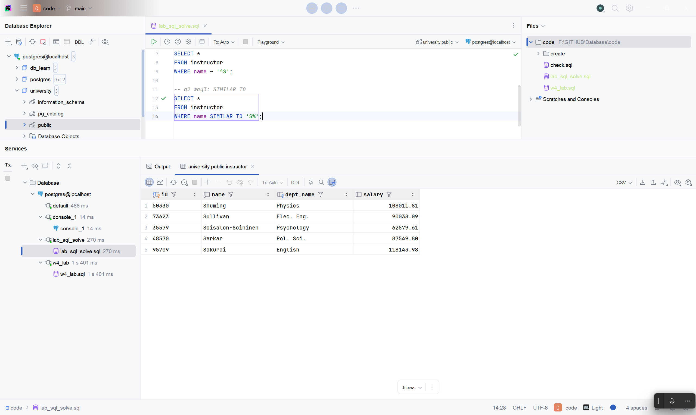
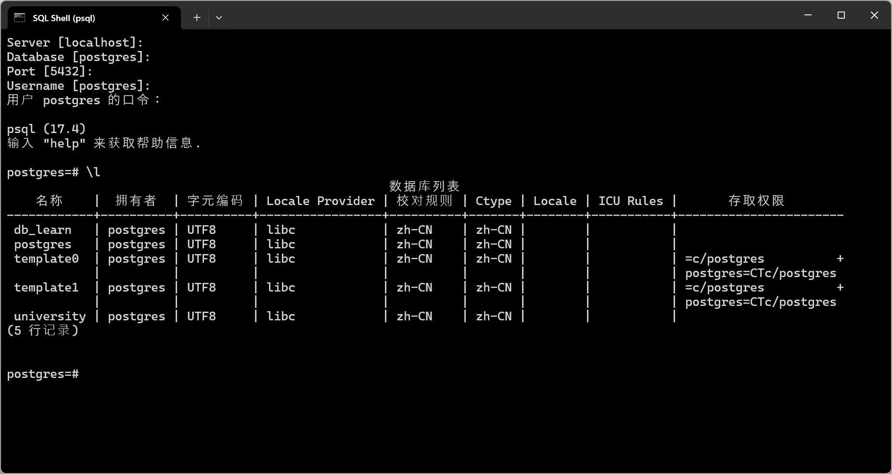
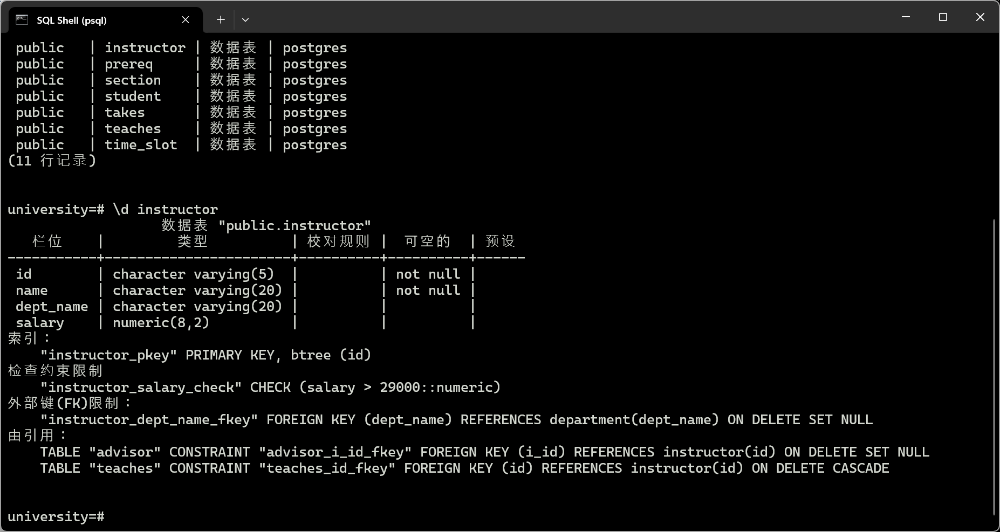
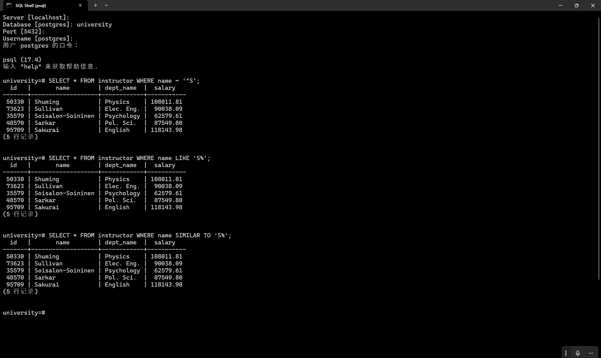

# lab_sql 作业解答

所有代码可见根目录 code 文件夹`lab_sql_solve.sql`
[查看源码](/code/lab_sql_solve.sql)

## 问题一

> 需要使用 PostgreSQL 及 DataGrip 软件操作，并对操作页面及结果进行截图。
>
> 1.新建一个 university 数据库，并执行`largeRelationsInsertFile.sql`，导入数据。
>
> 2.运行第 2 次作业的题目三代码。注意：把原题目中的会计改成 History。

- 如图所示



共在 university 的 public schema 下导入 11 张表

- 如图所示


## 问题二

> 参考[Pattern Matching](https://www.postgresql.org/docs/17/functions-matching.html)，在 PG 中使用至少三种方法实现找到所有以`S`开头教师的名字。

- 方法一：LIKE()

```sql
-- q2 way1:LIKE()
SELECT
    *
FROM
    instructor
WHERE
    name LIKE 'S%';
```



- 方法二：~

```sql
-- q2 way2:~
SELECT
    *
FROM
    instructor
WHERE
    name ~ '^S';
```



- 方法三：SIMILAR TO

```sql
-- q2 way3: SIMILAR TO
SELECT
    *
FROM
    instructor
WHERE
    name SIMILAR TO 'S%';
```



## 问题三

> `psql`是 PostgreSQL 的命令行工具。请使用`psql`命令行工具：
>
> - 实现题目二
> - 列出所有的数据库
> - 列出当前数据库的所有表
> - 显示某张表的关系模式

- 先列出所有数据库

```bash
postgres=# \l
```



- 选择连接到`university`数据库并列出所有表
  (这里出了一些问题, 所以是选择退出重连的)

```bash
university=# \dt
```


- 显示`instructor`表的关系模式

```bash
university=# \d instructor
```



- 实现题目二

```bash
university=# SELECT * FROM instructor WHERE name ~ '^S';
```


