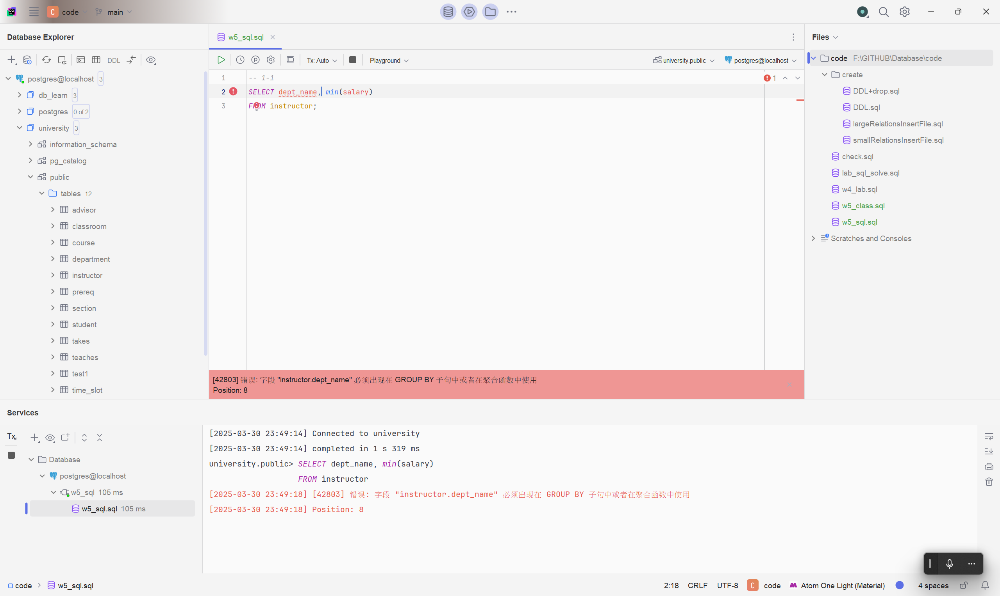
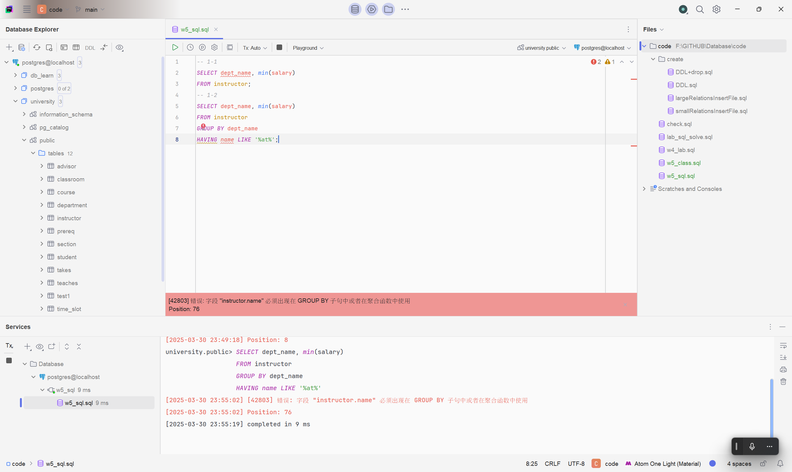
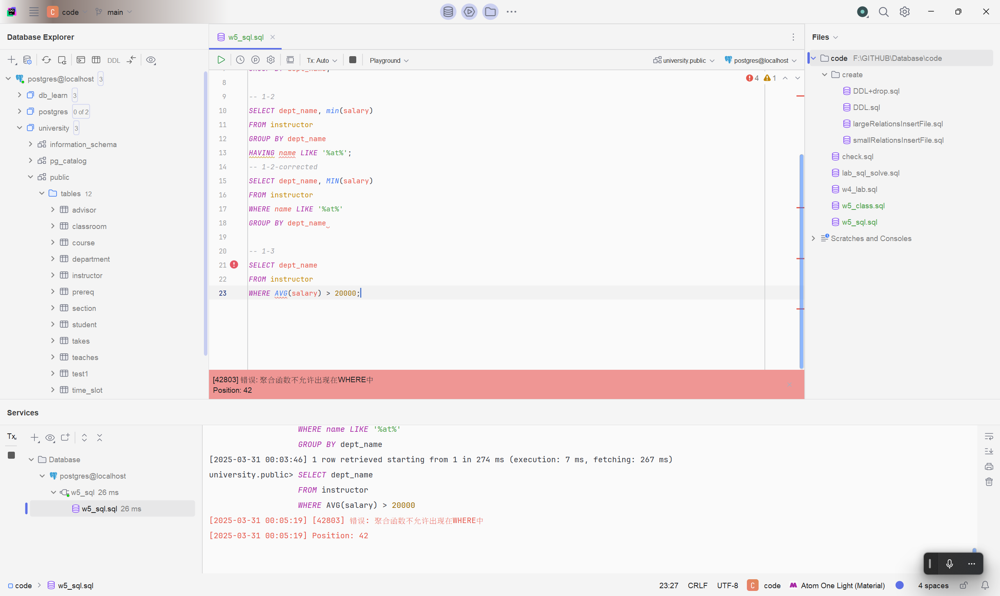
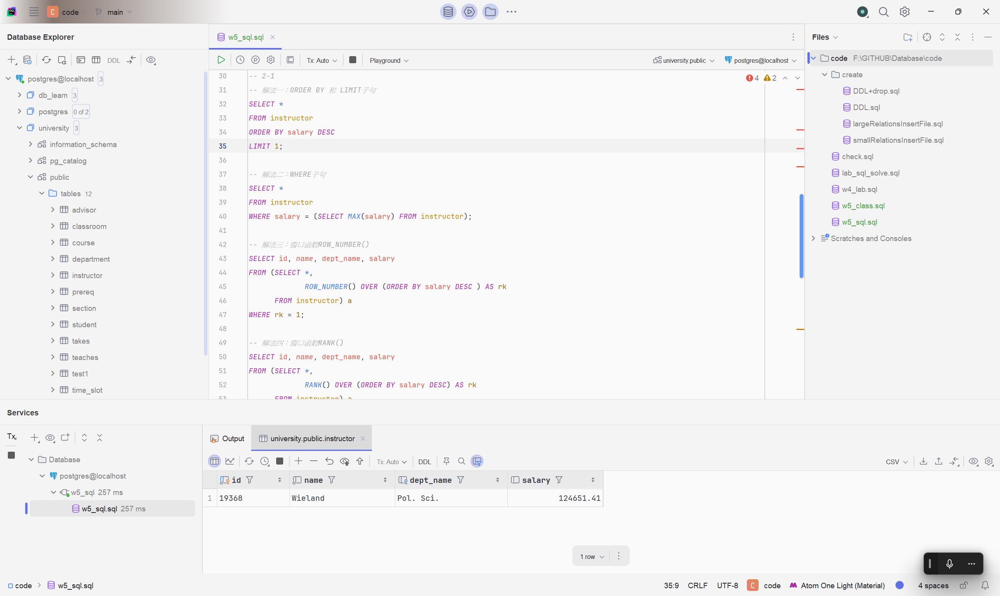
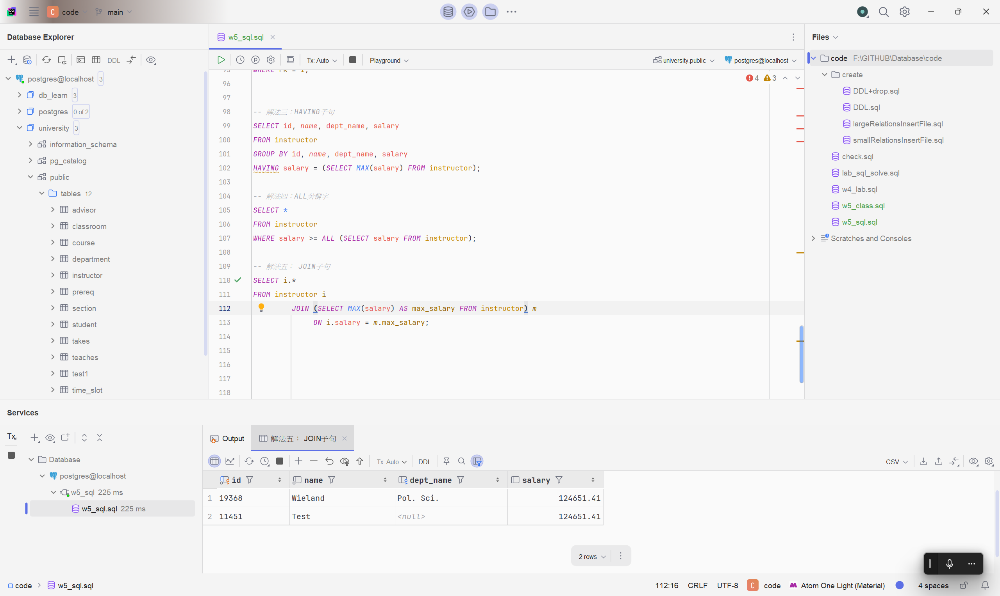

# SQL 作业解答

## 题目一

> 请问下面的 SQL 语句是否合法？用实验验证你的想法。你从实验结果能得到什么结论？
>
> ```sql
> SELECT dept_name, min(salary)
> FROM instructor;
>
> SELECT dept_name, min(salary)
> FROM instructor
> GROUP BY dept_name
> HAVING name LIKE '%at%';
>
> SELECT dept_name
> FROM instructor
> WHERE AVG(salary) > 20000;
> ```

1. 不合法，因为 min 函数需要作用在组上，而这里没有 group by。

```sql
SELECT dept_name, min(salary)
FROM instructor;
```



**修正:**

```sql
SELECT dept_name, min(salary)
FROM instructor
GROUP BY dept_name;
```


2. 不合法, Having 的字段 name 不在 group by 中, 会产生歧义, 因为 group by 后一个 dept_name 组内的 name 有多个值, 无法判断使用哪个 name 值来过滤.

```sql
SELECT dept_name, min(salary)
FROM instructor
GROUP BY dept_name
HAVING name LIKE '%at%';
```



**修正:**

```sql
SELECT dept_name, MIN(salary)
FROM instructor
WHERE name LIKE '%at%'
GROUP BY dept_name;
```


3. 不合法, 因为聚合函数不能在 where 中使用, 且必须要在 group by 中确定聚合的前置条件.

```sql
SELECT dept_name
FROM instructor
WHERE AVG(salary) > 20000;
```



**修正:**

```sql
SELECT dept_name
FROM instructor
GROUP BY dept_name
HAVING AVG(salary) > 20000;
```


## 题目二

> 1.  找到工资最高员工的名字，假设工资最高的员工只有一位（至少两种写法）。
>
> 2.  找到工资最高员工的名字，假设工资最高的员工有多位（试试多种写法）。
>
> 3.  解释下面四句。
>
> ```sql
> SELECT 1 IN (1);
>
> SELECT 1 = (1);
>
> SELECT (1, 2) = (1, 2);
>
> SELECT (1) IN (1, 2);
> ```

1.

```sql
-- 解法一：ORDER BY 和 LIMIT子句
SELECT *
FROM instructor
ORDER BY salary DESC
LIMIT 1;

-- 解法二：WHERE子句
SELECT *
FROM instructor
WHERE salary = (SELECT MAX(salary) FROM instructor);

-- 解法三：窗口函数ROW_NUMBER()
SELECT id, name, dept_name, salary
FROM (SELECT *,
             ROW_NUMBER() OVER (ORDER BY salary DESC ) AS rk
      FROM instructor) a
WHERE rk = 1;

-- 解法四：窗口函数RANK()
SELECT id, name, dept_name, salary
FROM (SELECT *,
             RANK() OVER (ORDER BY salary DESC) AS rk
      FROM instructor) a
WHERE rk = 1;

-- 解法五：窗口函数DENSE_RANK()
SELECT id, name, dept_name, salary
FROM (SELECT *,
             DENSE_RANK() OVER (ORDER BY salary DESC) AS rk
      FROM instructor) a
WHERE rk = 1;

-- 解法六：HAVING子句
SELECT id, name, dept_name, salary
FROM instructor
GROUP BY id, name, dept_name, salary
HAVING salary = (SELECT MAX(salary) FROM instructor);

-- 解法七：ALL关键字
SELECT *
FROM instructor
WHERE salary >= ALL (SELECT salary FROM instructor);

-- 解法八： JOIN子句
SELECT i.*
FROM instructor i
         JOIN (SELECT MAX(salary) AS max_salary FROM instructor) m
              ON i.salary = m.max_salary;

```

**经过验证, 上述所有解法输出相同**


2. 首先再插入一条数据

```sql
INSERT INTO instructor (id, name, dept_name, salary)
VALUES (11451, 'Test', NULL, 124651.41);
```

接下来, 展示有多个最高工资的员工时可使用的解法:(即去掉第一问的解法一、三、四)

```sql
-- 解法一：WHERE子句
SELECT *
FROM instructor
WHERE salary = (SELECT MAX(salary) FROM instructor);

-- 解法二：窗口函数RANK()
SELECT id, name, dept_name, salary
FROM (SELECT *,
             RANK() OVER (ORDER BY salary DESC) AS rk
      FROM instructor) a
WHERE rk = 1;


-- 解法三：HAVING子句
SELECT id, name, dept_name, salary
FROM instructor
GROUP BY id, name, dept_name, salary
HAVING salary = (SELECT MAX(salary) FROM instructor);

-- 解法四：ALL关键字
SELECT *
FROM instructor
WHERE salary >= ALL (SELECT salary FROM instructor);

-- 解法五： JOIN子句
SELECT i.*
FROM instructor i
         JOIN (SELECT MAX(salary) AS max_salary FROM instructor) m
              ON i.salary = m.max_salary;

```

**经过验证, 上述所有解法输出相同**


3. 首先经过测试这四句全部返回 TRUE

- 第一句

```sql
SELECT 1 IN (1);
```

检查标量 1 是否在只有1这个元素的集合 {1} 中, 显然满足, 返回 TRUE

- 第二句

```sql
SELECT 1 = (1);
```

检查标量 1 是否等于(1),由于单元素将被视为标量而不是元组, 因此相等, 返回 TRUE

- 第三句

```sql
SELECT (1, 2) = (1, 2);
```

检查元组 (1, 2) 是否等于元组 (1,2), 显然满足, 返回 TRUE

- 第四句

```sql
SELECT (1) IN (1, 2);
```

检查标量 1 是否在集合 {1, 2} 中, 显然满足, 返回 TRUE
