# SQL 作业解答

> 考虑关系模式`product(product_no, name, price)`，完成下面的题目：

所有代码可见根目录 code 文件夹`w6_sql.sql` [查看源码](/code/w6_sql.sql)

## 题目一

>在数据库中创建该关系，并自建上面关系的txt数据文件：
>
>1. 使用`COPY`命令导入数据库（PostgreSQL）；或使用`LOAD DATA`命令导入数据库（MySQL）。
>2. 将该关系导出为任意文件（如SQL、Txt、CSV、JSON等）。

数据准备:本次数据来源于[CSDN](https://blog.csdn.net/qq_52213943/article/details/124496420), 通过事前删除无关列后经由[duplicate.py](./code/duplicate.py)脚本去重, 删去空值后生成数据文件为[data.txt](./others/data.txt)

### COPY命令

1. 通过代码先创建表, 命名为`product`

```sql
CREATE TABLE product.product
(
    product_no CHAR(6) PRIMARY KEY,
    name       VARCHAR(15),
    price      NUMERIC(6, 2)
);
```

执行后如图, 成功创建空表
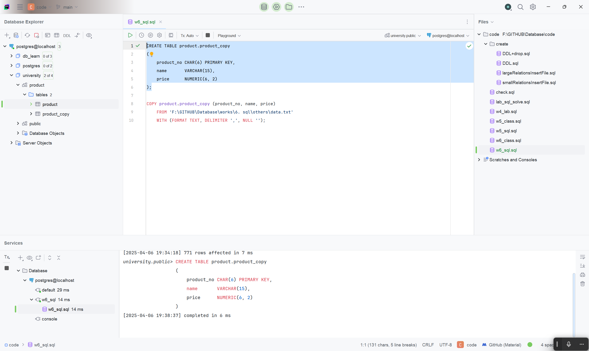

2. 使用`COPY`命令导入数据,设定分隔符为`,`, 绝对路径导入

```sql
COPY product.product (product_no, name, price)
    FROM 'F:\GITHUB\Database\works\6. sql\others\data.txt'
    WITH (FORMAT TEXT, DELIMITER ',', NULL '');
```

执行后如图, 成功导入数据
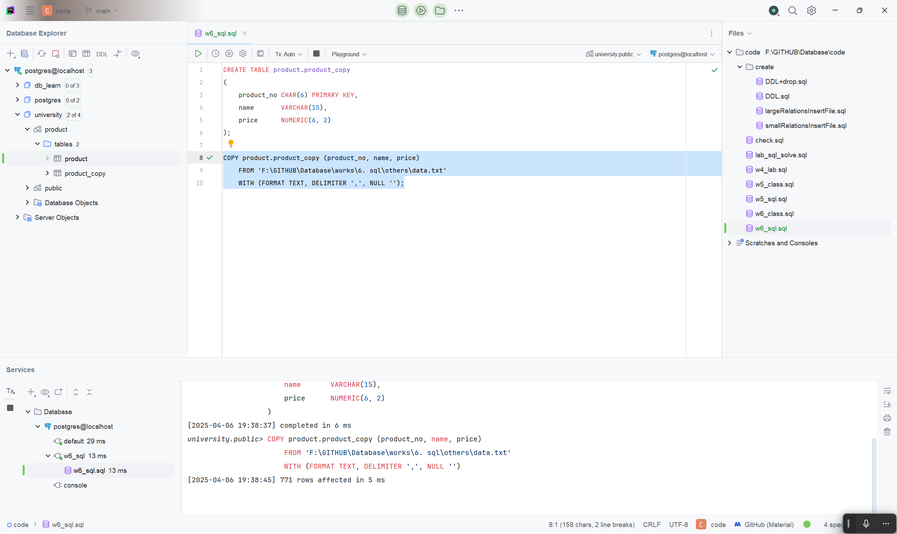

3. 查看表,共 771 行, 与 txt 中相符
   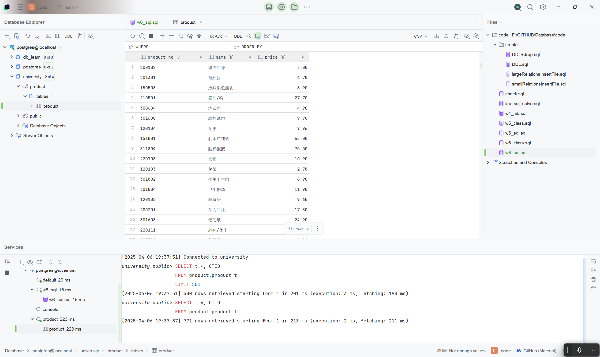

### 数据导出

1. 在左侧的关系中找到`product`表, 右键选择`import/export`->`export data to file`
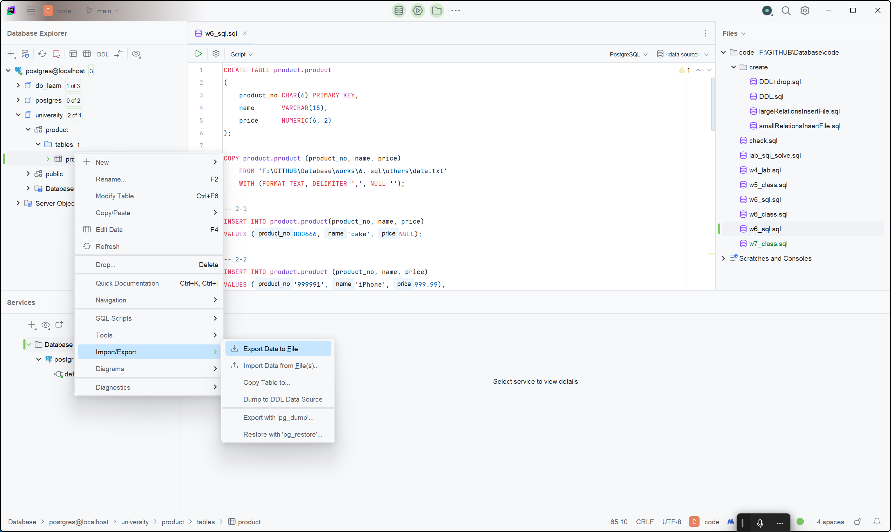

2. 选择导出格式为`SQL Inserts`,修改保存路径后, 点击`export to file`
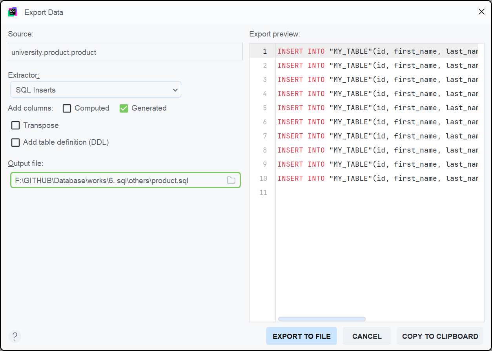

3. 右下角及终端提示成功, 导出文件为`product.sql`, 可以查看数据:[product.sql](others/product.sql)
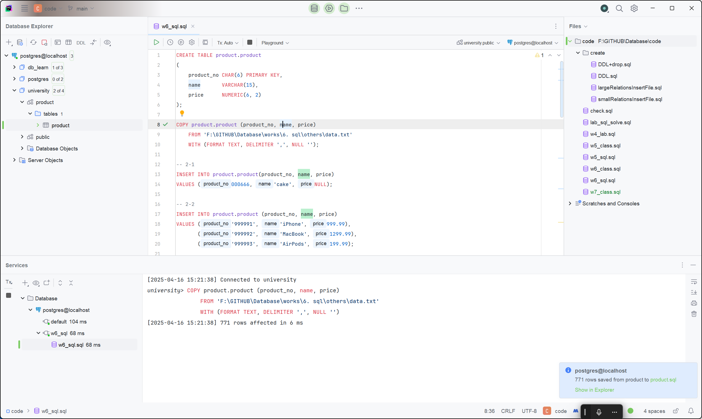


## 题目二

> 1. 添加一个新的商品，编号为`666`，名字为`cake`，价格不详。
> 2. 使用一条 SQL 语句同时添加 3 个商品，内容自拟。
> 3. 将商品价格统一打 8 折。
> 4. 将价格大于 100 的商品上涨 2%，其余上涨 4%。
> 5. 将名字包含`cake`的商品删除。
> 6. 将价格高于平均价格的商品删除。

### 1. 通过`INSERT`语句添加

```sql
INSERT INTO product.product(product_no, name, price)
VALUES (666, 'cake', NULL);
```

执行后如图, 成功添加


### 2. 仍然使用`INSERT`语句添加

```sql
INSERT INTO product.product (product_no, name, price)
VALUES ('999991', 'iPhone', 999.99),
       ('999992', 'MacBook', 1299.99),
       ('999993', 'AirPods', 199.99);
```

执行后如图, 成功添加


### 3. 通过`UPDATE`语句更新

```sql
UPDATE product.product
SET price=price * 0.8;
```

执行后如图, 成功打折
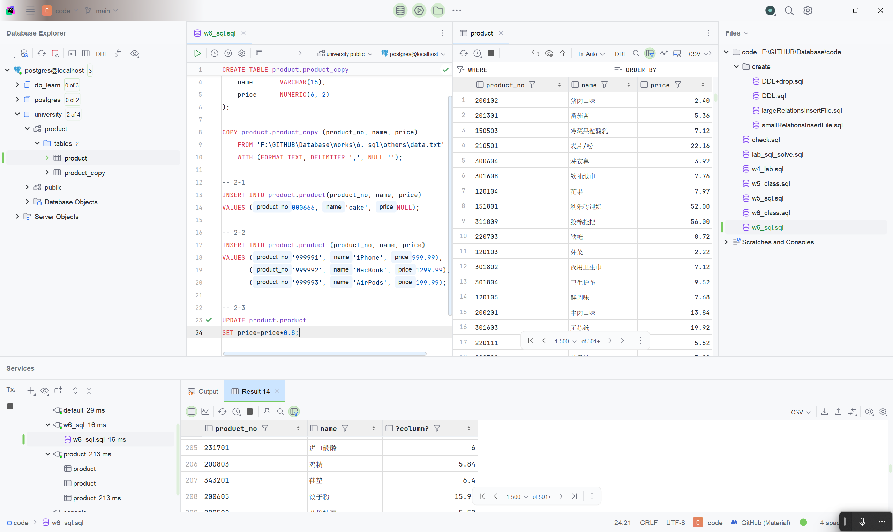

### 4. 通过`UPDATE`语句更新

```sql
UPDATE product.product
SET price = CASE
                WHEN price > 100 THEN price * 1.02
                ELSE price * 1.04
    END;
```

执行后如图, 成功更新
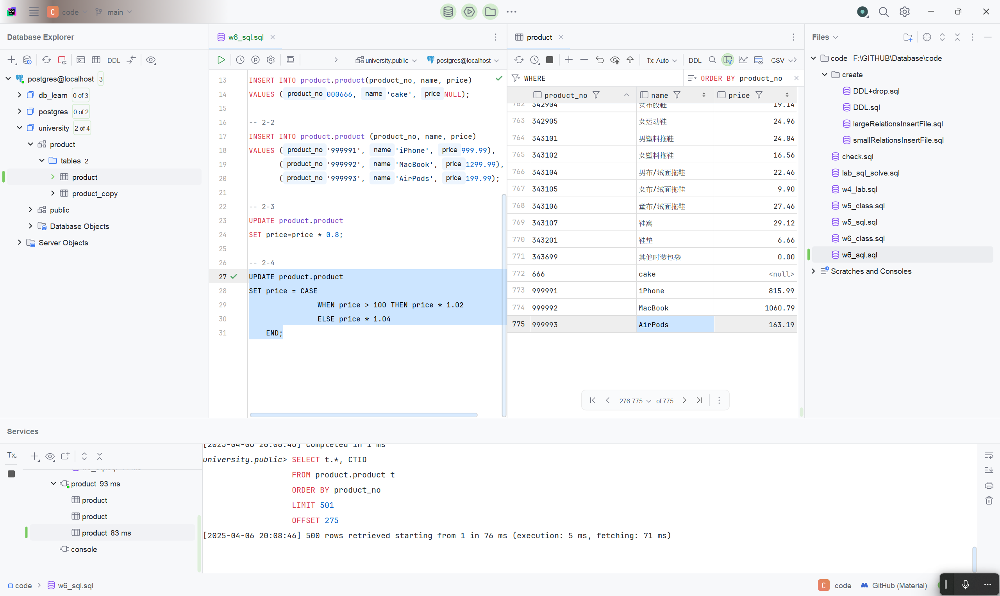

### 5. 通过`DELETE`语句删除

```sql
DELETE
FROM product.product
WHERE name LIKE '%cake%';
```

执行后如图, 成功删除
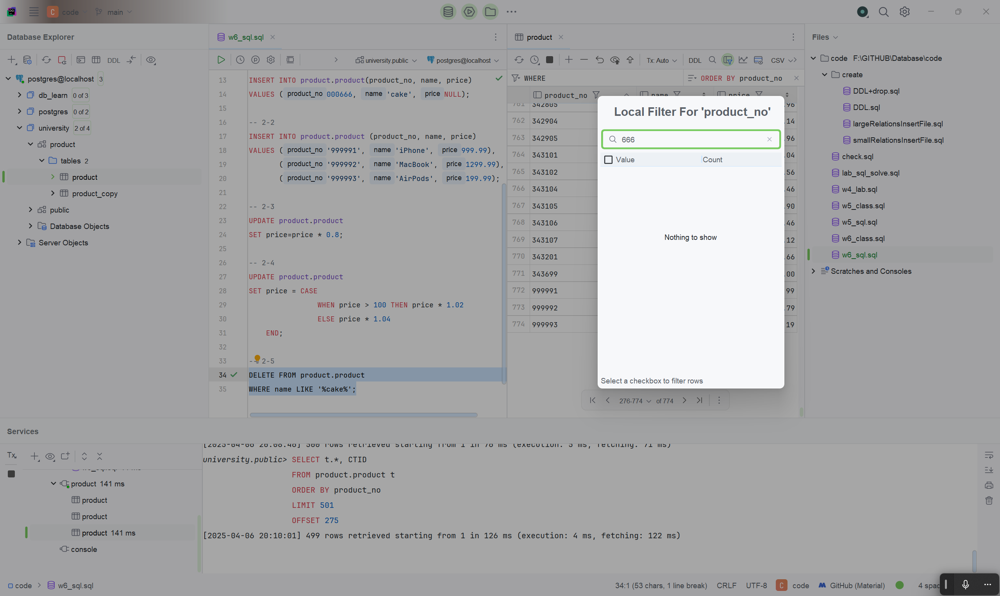

### 6. 通过`DELETE`语句删除

首先查看平均价格

```sql
SELECT AVG(price)
FROM product.product;
```

执行后如图, 平均价格为 19.21
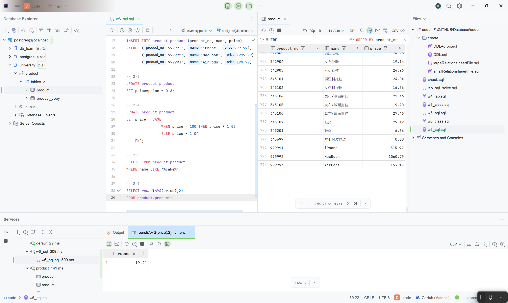

然后通过`DELETE`语句删除

```sql
DELETE
FROM product.product
WHERE price > (SELECT AVG(price) FROM product.product);
```

如图, 成功删除, 大于 19.21 的商品已经不在表格中, 包括第二小问添加的三个商品


## 题目三

> 使用参考下面的语句添加10万条商品，
> 
> ```sql
> -- PostgreSQL Only
> INSERT INTO product (name, price)
> SELECT
>     'Product' || generate_series, -- 生成名称 Product1, Product2, ...
>    ROUND((random() * 1000)::numeric, 2) -- 生成0到1000之间的随机价格，保留2位小数
> FROM generate_series(1, 100000);
> ```
> 
> 比较`DELETE`和`TRUNCATE`的性能差异。

首先在每次执行删除前都运行如下命令保证数据表相同:
```sql
COPY product.product (product_no, name, price)
    FROM 'F:\GITHUB\Database\works\6. sql\others\data.txt'
    WITH (FORMAT TEXT, DELIMITER ',', NULL '');

INSERT INTO product.product (product_no, name, price)
SELECT 't' || generate_series,
       'Product' || generate_series,        -- 生成名称 Product1, Product2, ...
       ROUND((RANDOM() * 1000)::numeric, 2) -- 生成0到1000之间的随机价格，保留2位小数
FROM GENERATE_SERIES(0, 99999);
```

然后分别对`delete`和`truncate`计时:

- `delete`

执行
```sql
\timing on
DELETE
FROM product.product;
\time off
```
如图:
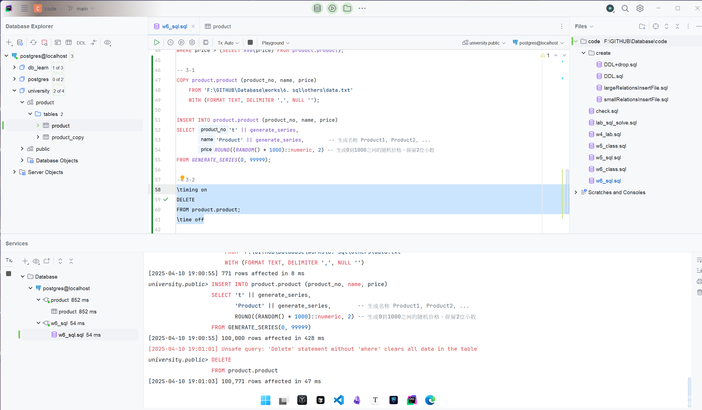
运行时间为 **47ms**

- `truncate`

执行
```sql
\timing on
TRUNCATE TABLE product.product;
\time off
```
如图:
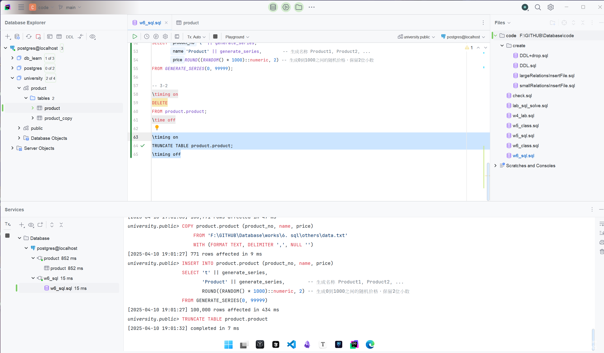
运行时间为**7ms**

结论:在删除表内容上, `truncate`比`delete`性能显著优异
