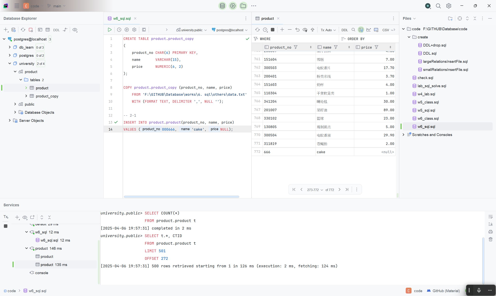
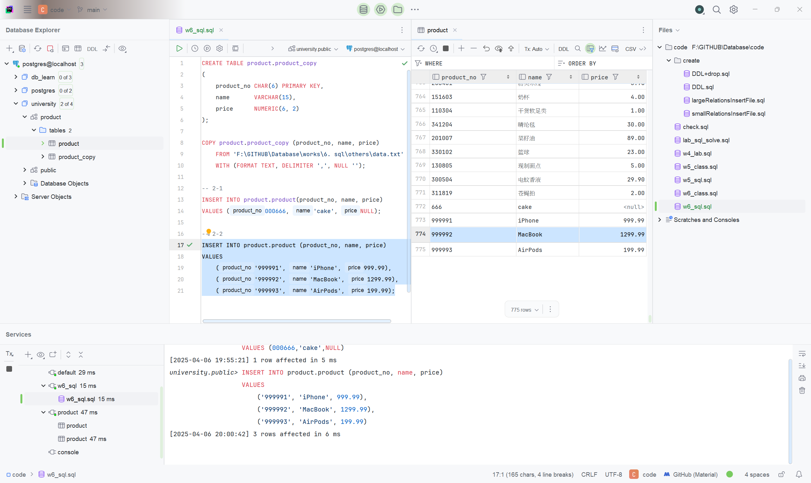
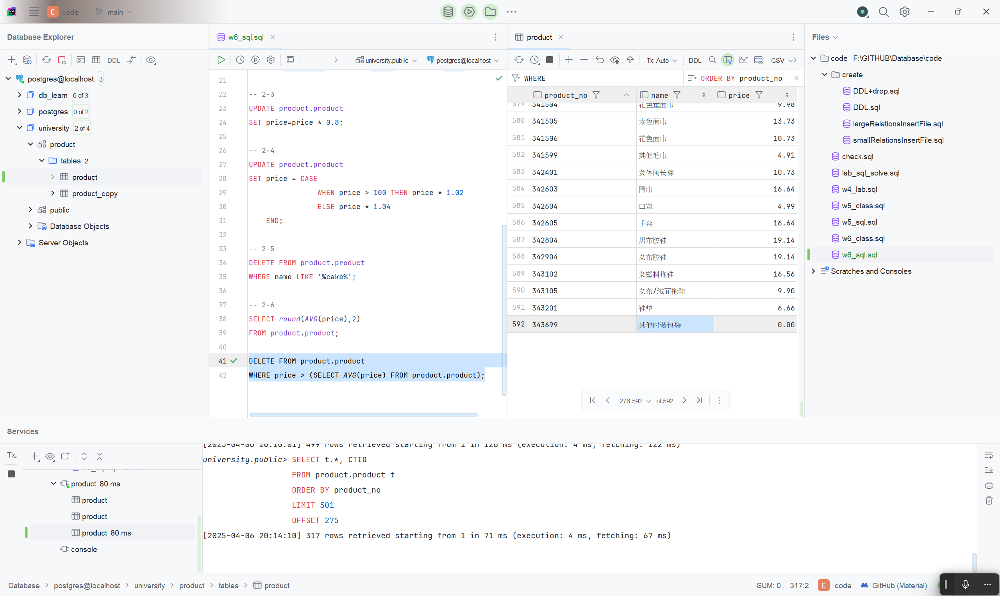

# SQL 作业解答

> 考虑关系模式`product(product_no, name, price)`，完成下面的题目：

所有代码可见根目录 code 文件夹`w6_sql.sql` [查看源码](/code/w6_sql.sql)

## 题目一

> 在数据库中创建该关系，并自建上面关系的 txt 数据文件，分别采用两种方式导入数据（要求截图重要步骤）：
>
> 1. 在 DataGrip 中可视化操作。
> 2. 使用`COPY`命令。

数据准备:本次数据来源于[CSDN](https://blog.csdn.net/qq_52213943/article/details/124496420), 通过事前删除无关列后经由[duplicate.py](./others/duplicate.py)脚本去重, 删去空值后生成数据文件为[data.txt](./others/data.txt)

### 关系创建

1. 首先选择 university 数据库,右键菜单中选择`New`->`Schema`
   

2. 在弹出的对话框中`Name`处输入`product`，然后点击`OK`即创建成功
   

### 方法 1

1. 在之前创建好的`product`关系上右键菜单中选择`Import/Export`->`Import Data from File(s)`
   

2. 在弹出的对话框找到之前创建好的`data.txt`文件, 点击`OK`
   

3. 根据题目要求命名 Table 为`product`, 然后更改对应列名以及数据类型, 然后`OK`
   

4. 如图, 导入成功, 共 771 行, 与 txt 中相符
   

### 方法 2

1. 通过代码先创建表, 命名为`product_copy`

```sql
CREATE TABLE product.product_copy
(
    product_no CHAR(6) PRIMARY KEY,
    name       VARCHAR(15),
    price      NUMERIC(6, 2)
);
```

执行后如图, 成功创建空表


2. 使用`COPY`命令导入数据,设定分隔符为`,`, 绝对路径导入

```sql
COPY product.product_copy (product_no, name, price)
    FROM 'F:\GITHUB\Database\works\6. sql\others\data.txt'
    WITH (FORMAT TEXT, DELIMITER ',', NULL '');
```

执行后如图, 成功导入数据


3.  查看表, 共 771 行, 与方法一和原始文件相符
    

## 题目二

> 1. 添加一个新的商品，编号为`666`，名字为`cake`，价格不详。
> 2. 使用一条 SQL 语句同时添加 3 个商品，内容自拟。
> 3. 将商品价格统一打 8 折。
> 4. 将价格大于 100 的商品上涨 2%，其余上涨 4%。
> 5. 将名字包含`cake`的商品删除。
> 6. 将价格高于平均价格的商品删除。

### 通过`INSERT`语句添加(这里由于定义原因, 补全编号为 6 位)

```sql
INSERT INTO product.product(product_no, name, price)
VALUES (000666, 'cake', NULL);
```

执行后如图, 成功添加


### 仍然使用`INSERT`语句添加

```sql
INSERT INTO product.product (product_no, name, price)
VALUES ('999991', 'iPhone', 999.99),
       ('999992', 'MacBook', 1299.99),
       ('999993', 'AirPods', 199.99);
```

执行后如图, 成功添加


### 通过`UPDATE`语句更新

```sql
UPDATE product.product
SET price=price * 0.8;
```

执行后如图, 成功打折


### 通过`UPDATE`语句更新

```sql
UPDATE product.product
SET price = CASE
                WHEN price > 100 THEN price * 1.02
                ELSE price * 1.04
    END;
```

执行后如图, 成功更新


### 通过`DELETE`语句删除

```sql
DELETE
FROM product.product
WHERE name LIKE '%cake%';
```

执行后如图, 成功删除


### 通过`DELETE`语句删除

首先查看平均价格

```sql
SELECT AVG(price)
FROM product.product;
```

执行后如图, 平均价格为 19.21


然后通过`DELETE`语句删除

```sql
DELETE
FROM product.product
WHERE price > (SELECT AVG(price) FROM product.product);
```

如图, 成功删除, 大于 19.21 的商品已经不在表格中, 包括第二小问添加的三个商品

