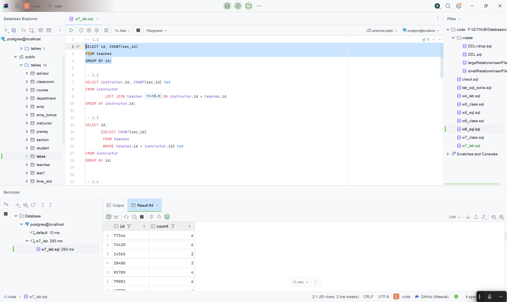
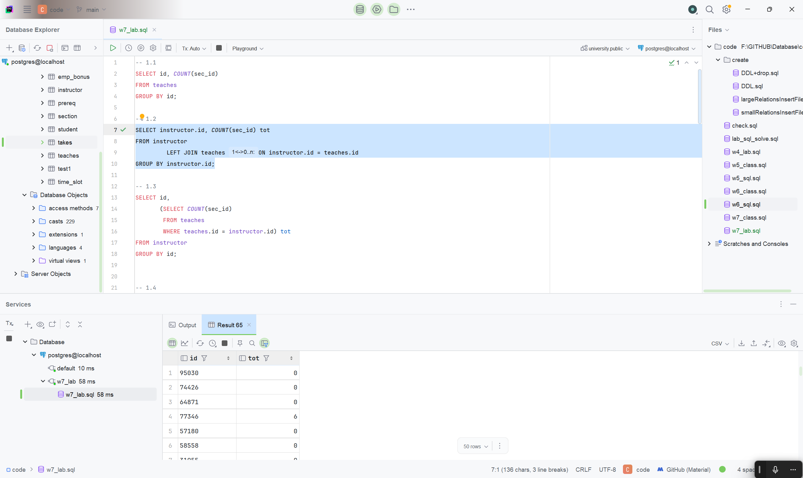
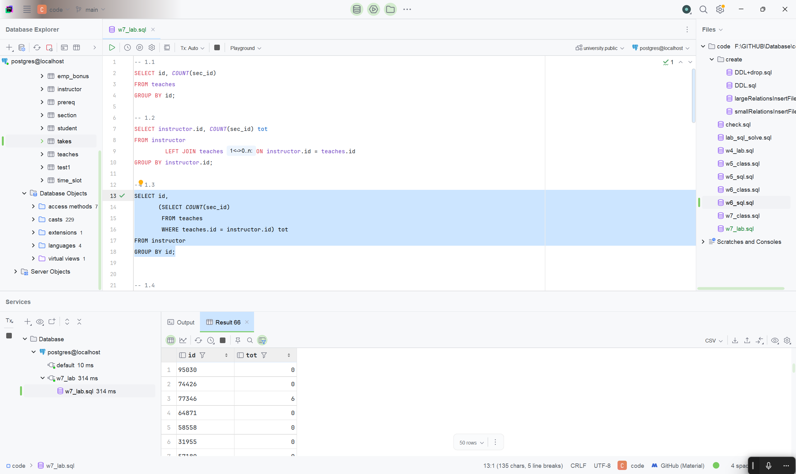
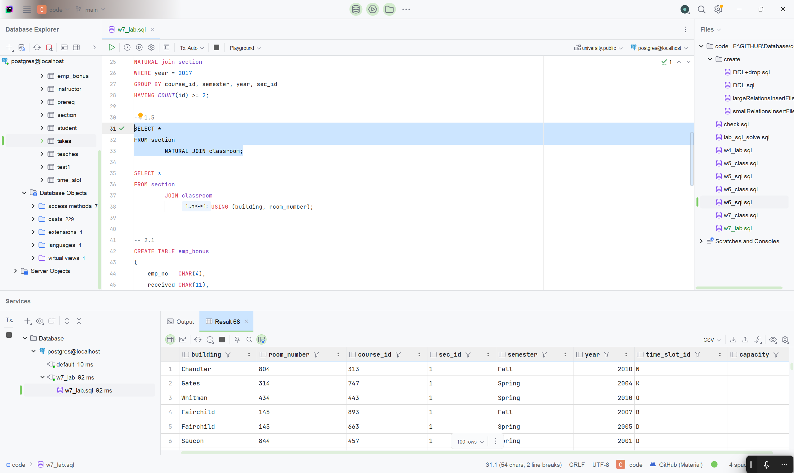
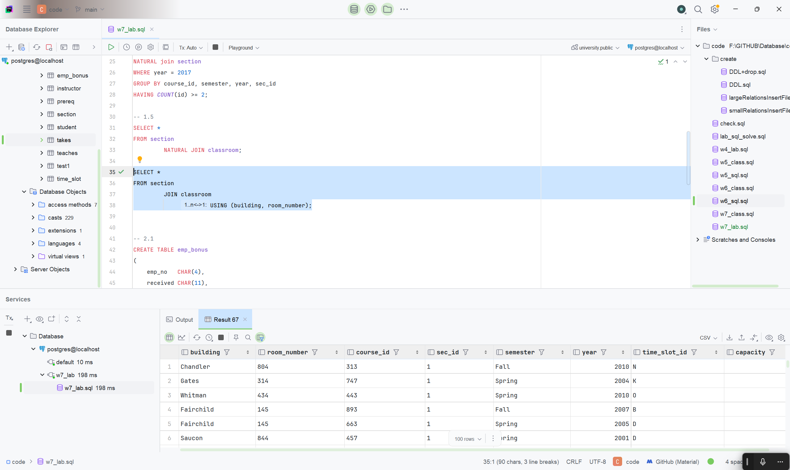
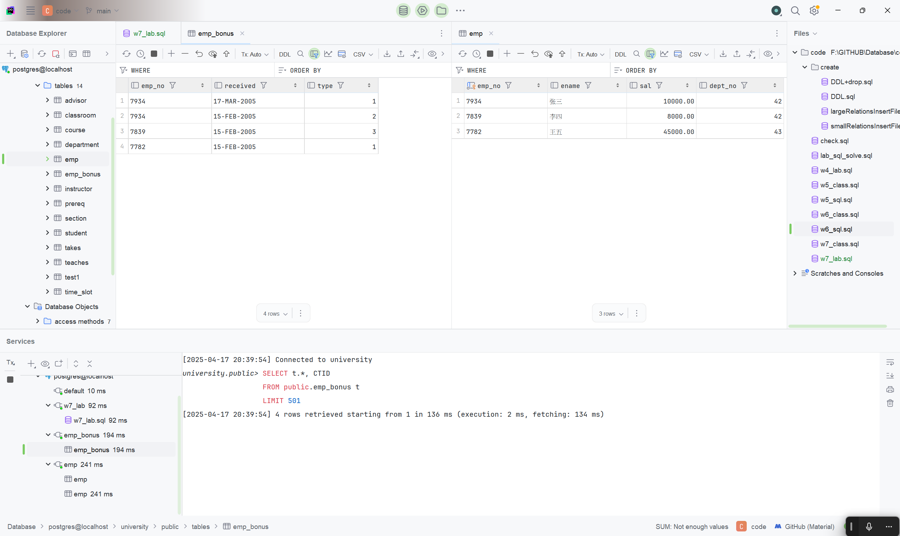
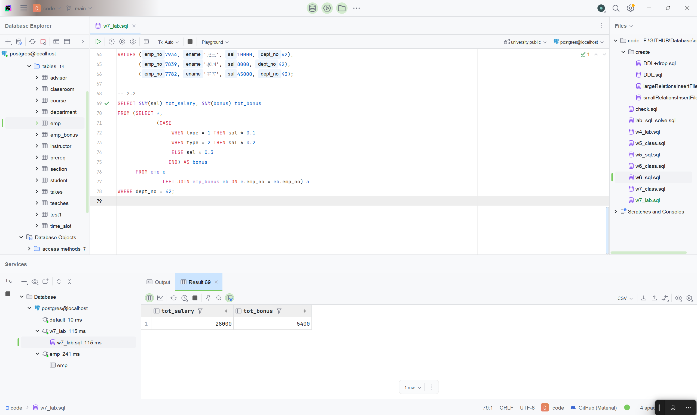

# 测试解答

所有代码可见根目录 code 文件夹`w7_lab.sql` [查看源码](/code/w7_lab.sql)

## 大学数据库

> > 根据课堂使用的 `university` 数据库,完成以下操作。
>
> 1.  展示每个教师( `instructor` )的工号及其授课课程段( `section `)的数量。如果仅仅考虑授课的老师,请使用单表查询完成。
> 2.  对于第 1 题,请确保即使没有授课的教师也要被输出。使用 JOIN 完成。
> 3.  请使用标量子查询(scalar subquery)完成第 2 题。
> 4.  解释为什么在 `from` 子句中追加 `natural join section` 并不会影响结果。
>
> ```sql
> SELECT course_id, semester, year, sec_id, AVG(tot_cred)
> FROM takes
>         NATURAL JOIN student
> WHERE year = 2017
> GROUP BY course_id, semester, year, sec_id
> HAVING COUNT(id) >= 2;
> ```
>
> 5.  使用 `using` 重写下面的查询:
>
> ```sql
> select * from section natural join classroom;
> ```

1.

```sql
SELECT id, COUNT(sec_id)
FROM teaches
GROUP BY id;
```

 2.

```sql
SELECT instructor.id, COUNT(sec_id) tot
FROM instructor
         LEFT JOIN teaches ON instructor.id = teaches.id
GROUP BY instructor.id;
```

 3.

```sql
SELECT id,
       (SELECT COUNT(sec_id)
        FROM teaches
        WHERE teaches.id = instructor.id) tot
FROM instructor
GROUP BY id;
```

 4.

观察 `section` 表的 DDL(这里通过直接在 datagrip 自动生成的得到):

```sql
-- auto-generated definition
CREATE TABLE section
(
course_id varchar(8) NOT NULL
REFERENCES course
ON DELETE CASCADE,
sec_id varchar(8) NOT NULL,
semester varchar(6) NOT NULL
CONSTRAINT section_semester_check
CHECK ((semester)::text = ANY
((ARRAY ['Fall'::character varying, 'Winter'::character varying, 'Spring'::character varying, 'Summer'::character varying])::text[])),
year numeric(4) NOT NULL
CONSTRAINT section_year_check
CHECK ((year > (1701)::numeric) AND (year < (2100)::numeric)),
building varchar(15),
room_number varchar(7),
time_slot_id varchar(4),
PRIMARY KEY (course_id, sec_id, semester, year),
FOREIGN KEY (building, room_number) REFERENCES classroom
ON DELETE SET NULL
);

ALTER TABLE section
OWNER TO postgres;
```

以及`takes`表的 DDL:

```sql
-- auto-generated definition
CREATE TABLE takes
(
id varchar(5) NOT NULL
REFERENCES student
ON DELETE CASCADE,
course_id varchar(8) NOT NULL,
sec_id varchar(8) NOT NULL,
semester varchar(6) NOT NULL,
year numeric(4) NOT NULL,
grade varchar(2),
PRIMARY KEY (id, course_id, sec_id, semester, year),
FOREIGN KEY (course_id, sec_id, semester, year) REFERENCES section
ON DELETE CASCADE
);

ALTER TABLE takes
OWNER TO postgres;
```

可以看到, `takes`表的外键约束(FOREIGN KEY (course_id, sec_id, semester, year) REFERENCES section) 会使得 `section` 表的 `course_id`, `sec_id`, `semester`, `year` 列与`section`表的记录精确匹配, 同时自然连接`section`时通过(course_id, sec_id, semester, year) 进行匹配, 因此每个`takes`与`section`的连接都是唯一的, 不会丢失或者增加任何信息
同时, 原有的查询语句中, 涉及到的列与只在`section`中有记录的列无关, 因此不会影响结果

5. 查询改写为

```sql
SELECT *
FROM section
         JOIN classroom
              USING (building, room_number);
```

修改前:

修改后:


## 应用题

> 考虑一个 emp_bonus 表,表示员工的奖金发送信息,内容如下:
> | emp no | received | type |
> |--------|-------------|------|
> | 7934 | 17-MAR-2005 | 1 |
> | 7934 | 15-FEB-2005 | 2 |
> | 7839 | 15-FEB-2005 | 3 |
> | 7782 | 15-FEB-2005 | 1 |
>
> 其中,`emp_no` 表示员工工号,`received` 表示奖金发放日期,`type` 表示奖金类型,其中类型 1 表示其工资的 $10\%$ ,类型 2 表示其工资的 $20\%$ ,类型 3 表示其工资的 $30\%$ 。
> 员工表 `emp` 的关系模式是 `emp(emp_no, ename, sal, dept_no)` ,分别是员工工号、姓名、工资和部门编号。
>
> 1.  创建两个关系,并添加测试数据,其中 `emp_bonus` 的内容严格按上表所示。
> 2.  请列出部门编号为 42 的所有员工的总工资及其总奖金。

1.

- emp_bonus 表:

```sql
CREATE TABLE emp_bonus
(
    emp_no   CHAR(4),
    received CHAR(11),
    type     INTEGER CHECK (type IN (1, 2, 3))
);

INSERT INTO emp_bonus(emp_no, received, type)
VALUES ('7934', '17-MAR-2005', 1),
       ('7934', '15-FEB-2005', 2),
       ('7839', '15-FEB-2005', 3),
       ('7782', '15-FEB-2005', 1);
```

- emp 表

```sql
CREATE TABLE emp
(
    emp_no  CHAR(4) PRIMARY KEY,
    ename   VARCHAR(6),
    sal     NUMERIC(10, 2),
    dept_no INTEGER
);

INSERT INTO emp(emp_no, ename, sal, dept_no)
VALUES (7934, '张三', 10000, 42),
       (7839, '李四', 8000, 42),
       (7782, '王五', 45000, 43);
```

 2.

```sql
SELECT SUM(sal) tot_salary, SUM(bonus) tot_bonus
FROM (SELECT *,
             (CASE
                  WHEN type = 1 THEN sal * 0.1
                  WHEN type = 2 THEN sal * 0.2
                  ELSE sal * 0.3
                 END) AS bonus
      FROM emp e
               LEFT JOIN emp_bonus eb ON e.emp_no = eb.emp_no) a
WHERE dept_no = 42
```


