# NoSQL 安装

> 安装一个非关系型数据库（不限制），并完成简单的增、删、改、查。需要截图操作。

本机环境:  macOS Sequoia 15.4.1

本次选择的数据库为: Redis

安装参照https://redis.io/docs/latest/operate/oss_and_stack/install/archive/install-redis/install-redis-on-mac-os/ 进行


## 检查brew版本

输入
```bash
brew --version
```
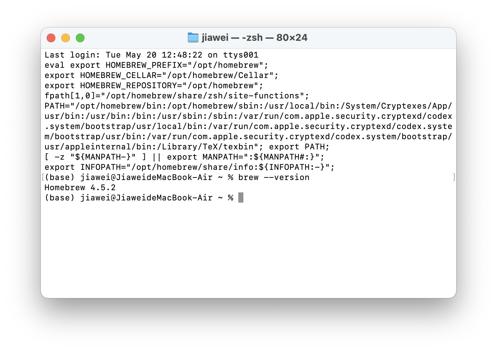

环境变量正常, 可以安装

## 安装Redis

输入
```bash
brew install redis
```
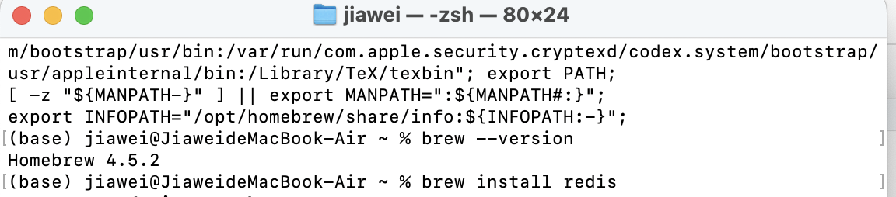

运行结果

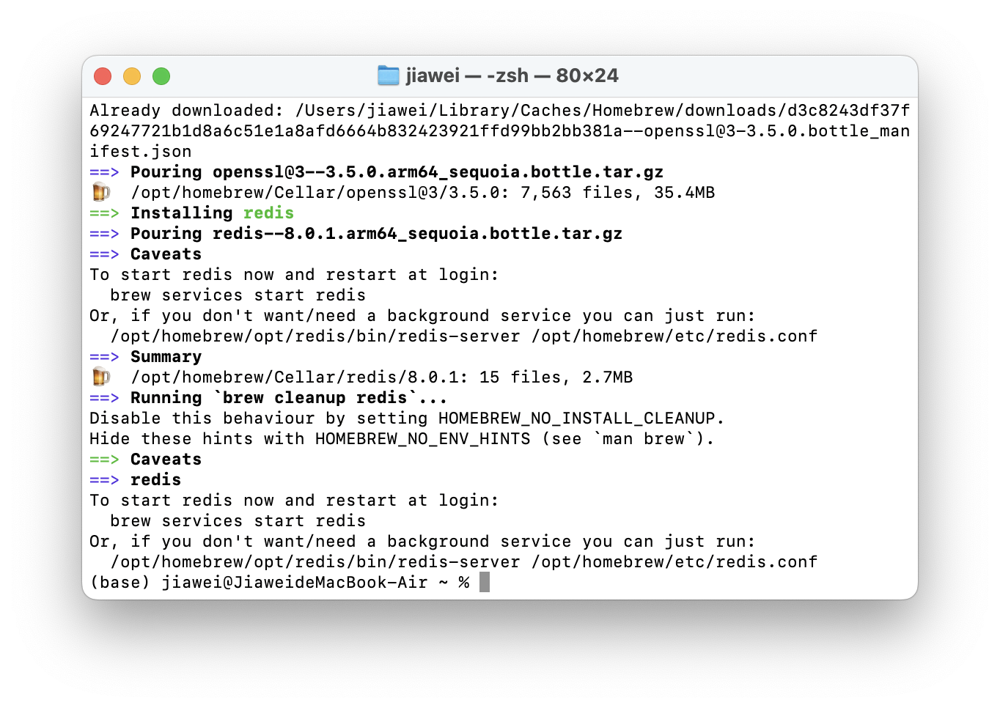

## 验证安装

```bash
redis-server
```
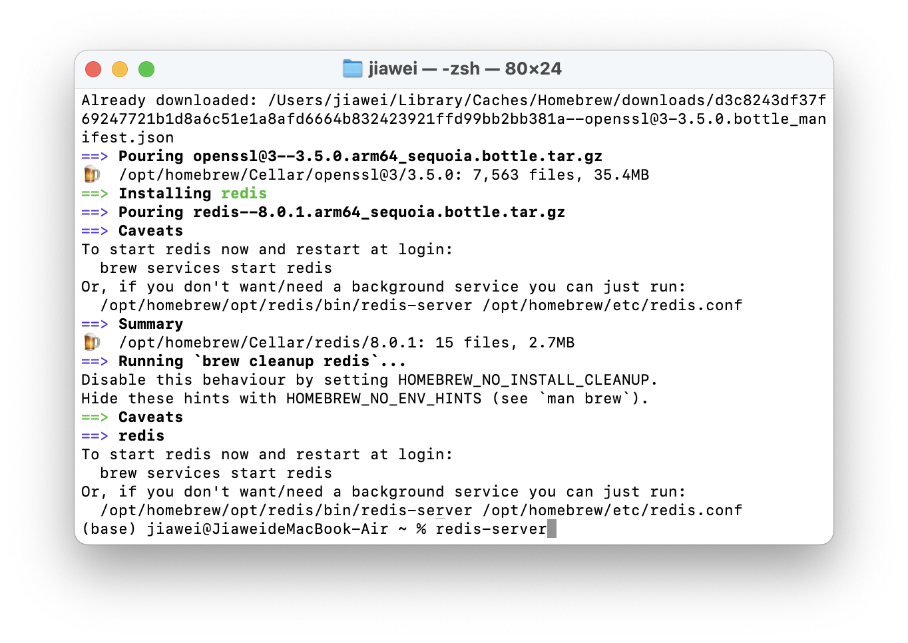

出现配置文件, 启动成功, 说明安装完成

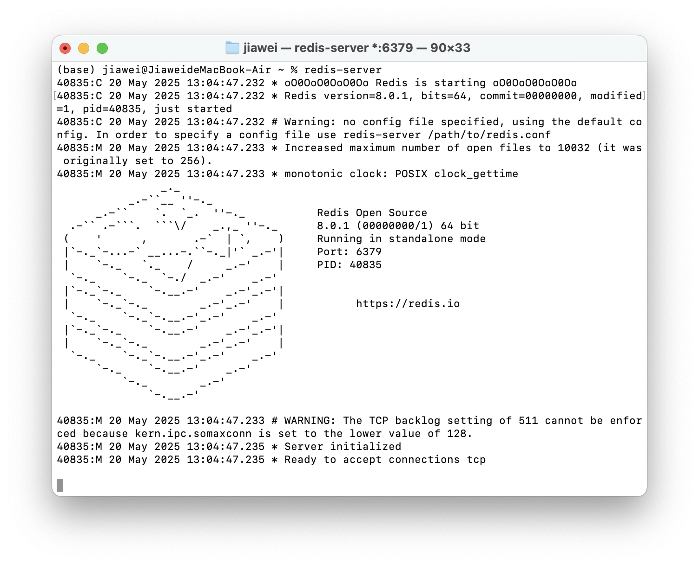

最后通过 `Ctrl+c`退出

# 增删改查操作

首先连接Redis数据库

首先启动redis, 这一步可以使用验证安装的命令,然后在新窗口连接, 或者通过homebrew进行连接和退出
```bash
# 连接
brew services start redis

# 退出
brew services stop redis
```

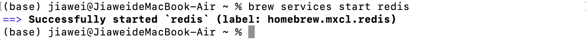

然后输入
```bash
redis-cli
```
进入Redis


## 增
加入键值对: `user_1:hejw`
```Redis
set user_1 "hejw"
```
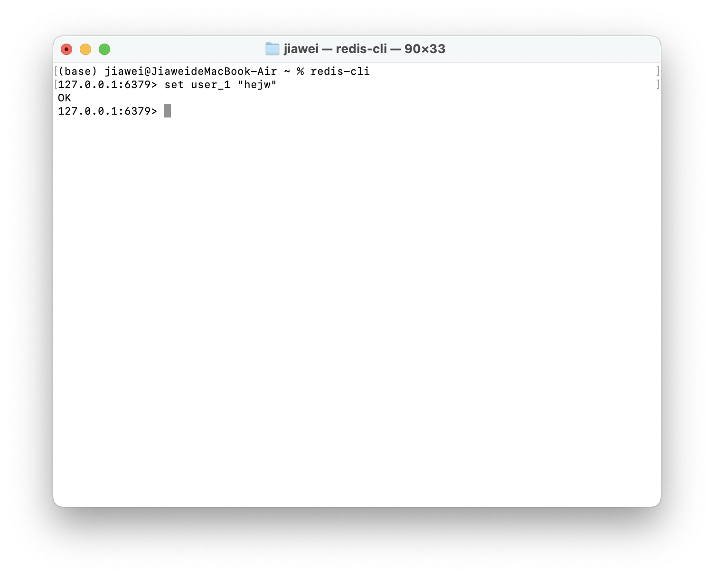

## 查

查看`user_1`字段
```Redis
get user_1
```
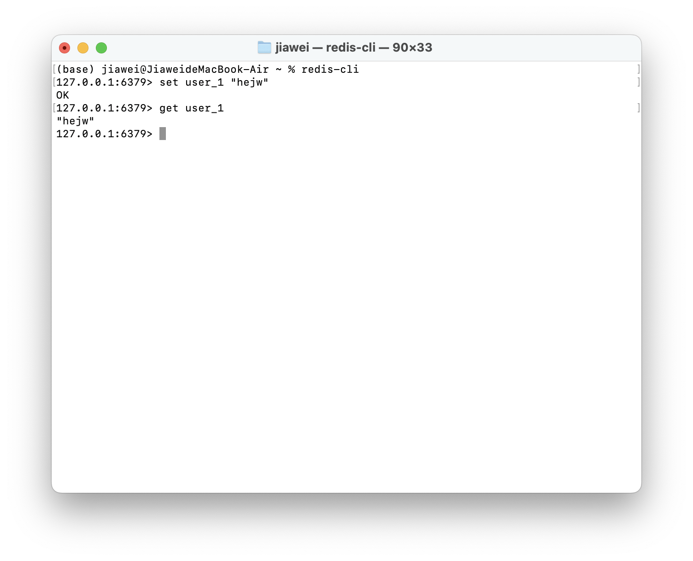

## 改

按照增的方式修改原键即可
```Redis
set user_1 "He_jw"
```
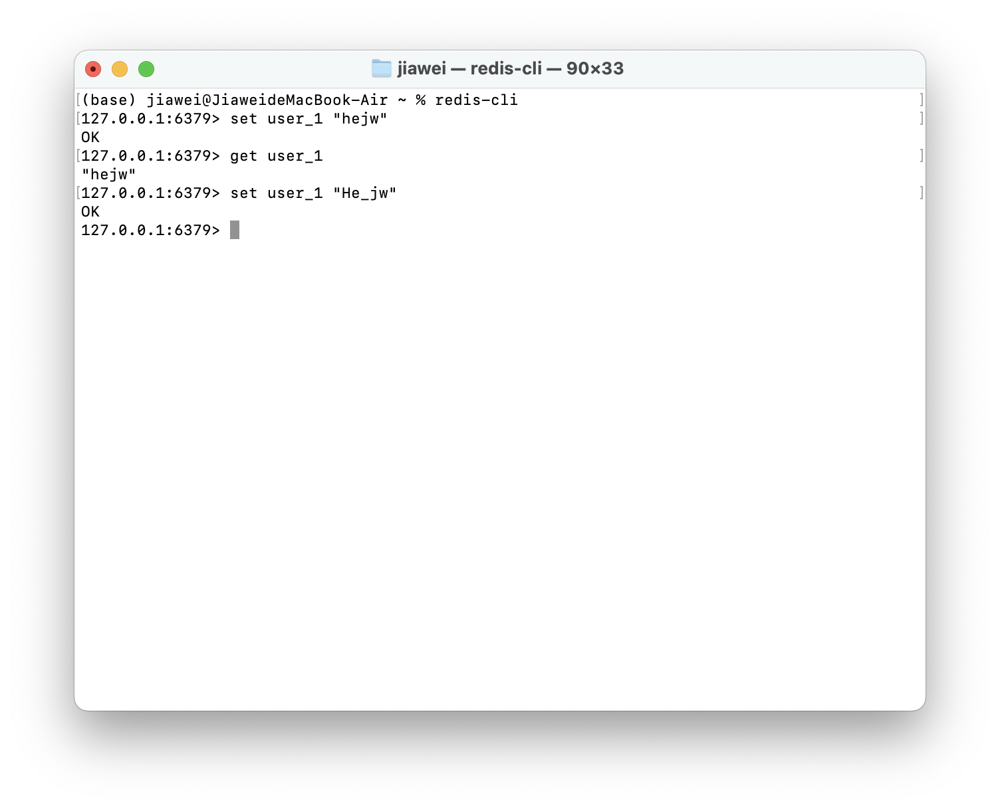

再次查看

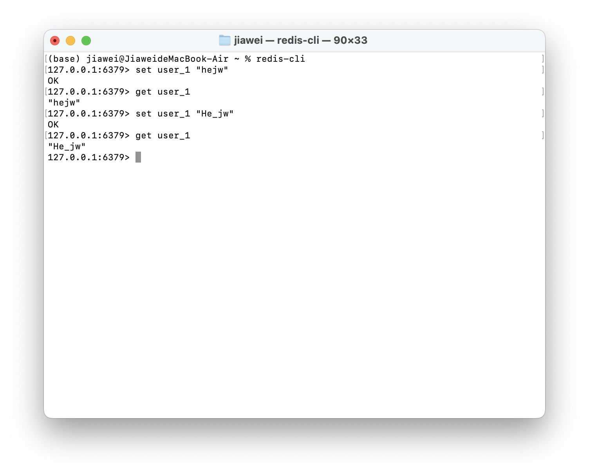

发现修改成功

## 删

输入
```bash
DEL user_1
```

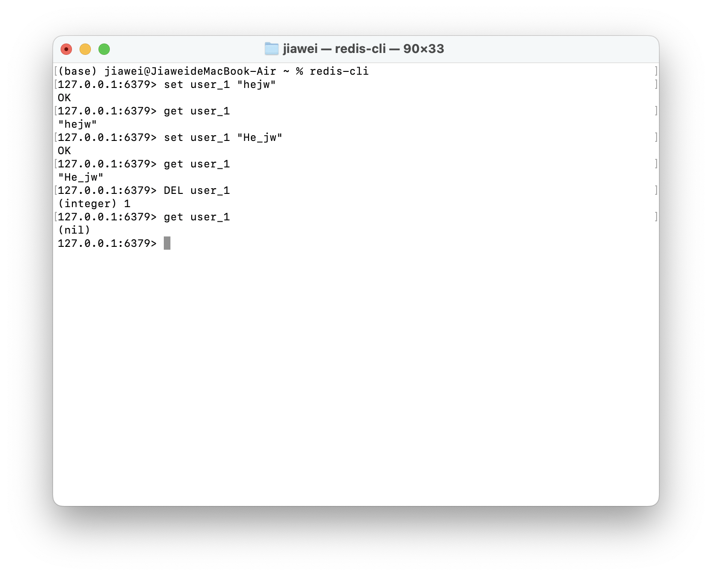
运行后返回 `(integer) 1` 成功删除一个键

再次尝试查询`user_1`时出现空值, 说明删除成功

# 退出

最后退出客户端
```Redis
EXIT
```
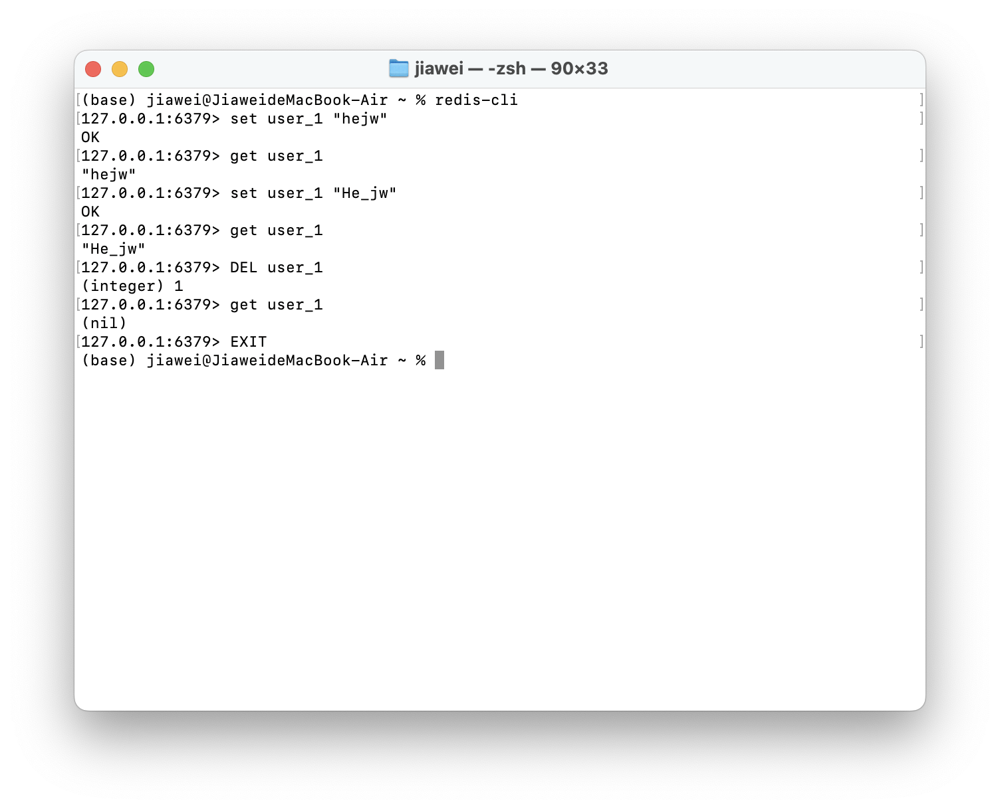
关闭后台Redis进程
```bash
brew services stop redis
```
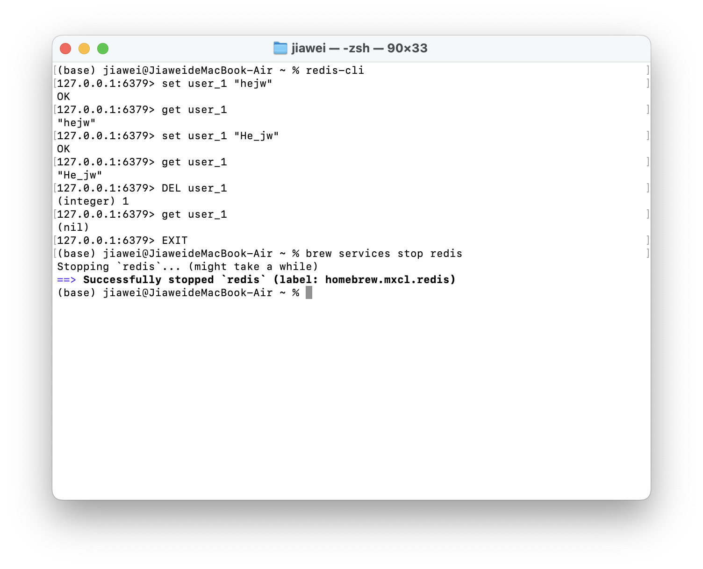