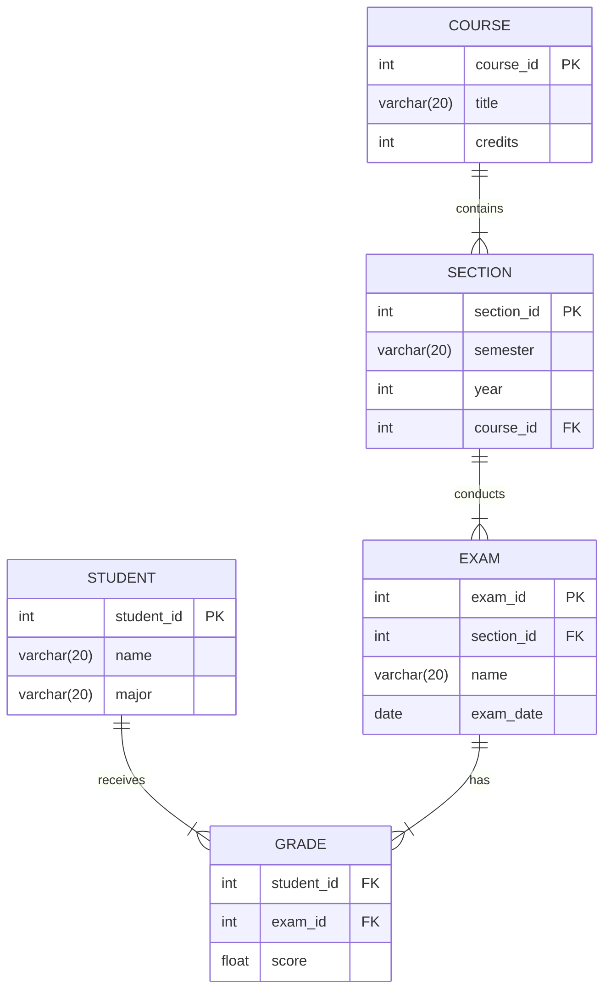

# ER 作业解答

## 题目一（3 分+2 分）

> 考虑一个用于记录学生（student）在不同课程段（section）在不同考试中取得成绩（grade）的数据库，其中课程段属于某个课程（course）。
>
> 1.  绘制 E-R 图，只用二元联系。确保能够表示一个学生在不同考试中获得的成绩，且一个课程段可能有多次考试。（提示：使用多值属性）
>
> 2.  写出上面 E-R 图的关系模式（要求注明主码）。

1.

关系模式如下图. 其中主码用`PK`表示, 外码用`FK`表示. COURSE 和 SECTION 是一对多关系, SECTION 和 EXAM 是一对多关系, EXAM 和 GRADE 时一对多关系, GRADE 和 STUDENT 是多对一关系.



2. 关系模式为

```sql
STUDENT(student_id PRIMARY KEY, name, major)
GRADE(student_id FOREIGN KEY REFERENCES STUDENT(student_id), exam_id FOREIGN KEY REFERENCES EXAM(exam_id), score)
EXAM(exam_id PRIMARY KEY, section_id FOREIGN KEY REFERENCES SECTION(section_id), name, exam_date)
SECTION(section_id PRIMARY KEY, semester, year, course_id FOREIGN KEY REFERENCES COURSE(course_id))
COURSE(course_id PRIMARY KEY, title, credits)
```

## 题目二（5 分）

> 如果一个关系模式中只有两个属性，证明该关系模式必定属于 BCNF。

证明:

不妨设关系模式为`R(A, B)`, 其中A和B是两个属性. 

考虑所有非平凡依赖, 有以下三种情况:

1. A -> B:此时A是主码, 所以R属于BCNF.

2. B -> A:此时B是主码, 所以R属于BCNF.

3. A -> B, B -> A:此时A和B都是主码, 所以R属于BCNF.

因此, 所有非平凡依赖都满足BCNF, 所以R属于BCNF.


## 题目三（5 分）

> 考虑关系模式`r(A, B, C, D, E)`，有如下函数依赖：
>
> - A → BC
> - BC → E
> - CD → AB
>
> 请给出一个满足 BCNF 的分解，并说明你的分解符合 BCNF。


可以看到AD是候选码, 所以分解为: $R_1(A, B, C), R_2(A, E), R_3(A, D)$

此时R1, R2和R3都满足BCNF, 证明如下:

1. 对于R1, 有A -> BC, 所以A是主码, 所以R1满足BCNF.

2. 对于R2, 有A -> BC -> E, 所以A是主码, 所以R2满足BCNF.

3. 对于R3, 没有非平凡依赖, 所以R3满足BCNF.

因此, 分解符合BCNF.
