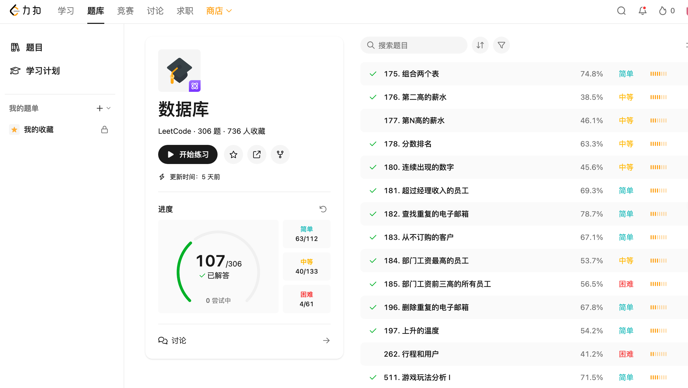
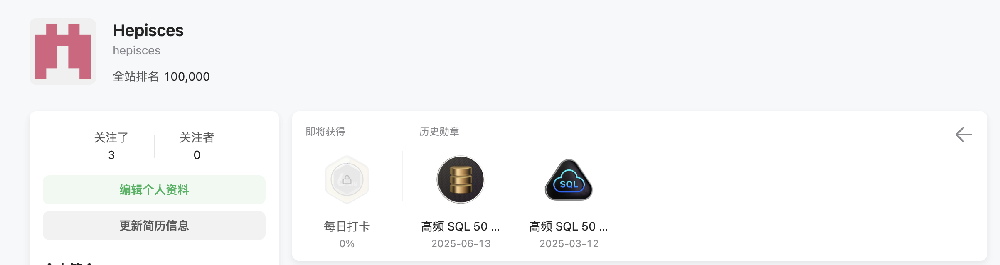

<div align="center">
    <font size="15">
    <b>
    自我评价
    </b>
    </font>

</div>

<div align="right"> 42233042 和嘉炜 </div>
<div align="right"> 2025.6.15 </div>

# 每章总结

这个章节数根据笔记的章节进行整理, 和上课的实际内容会有些许出入, 比如 DDL 中的检查部分和基本语法放在了一起, 数据类型是各几周的总结版, 分散的理论部分也被收集总结到理论章节.

## 概述

数据库的基本概念, 应用, 角色;数据库的数据存储方式, 包括文件处理系统的局限性（数据冗余、数据隔离、访问困难、完整性问题、并发访问异常和原子性问题）以及 DBMS 的优势。介绍了数据抽象的三个层次（物理层、逻辑层和视图层）以及不同的数据模型（关系模型、实体关系模型、半结构化数据模型等）;数据库语言（DDL 和 DML）以及数据库系统架构。

## 关系模型

数据库中最常用的数据模型, 由表的集合组成, 每个表（关系）由行（元组）和列（属性）组成, 其中行表示一组值之间的关系. 

关系模式定义了关系的名称和属性集, 而关系实例则是特定时刻数据库中数据的快照. 关系模型的核心概念包括关系、元组和属性, 它们分别对应 Excel 中的表、行和列.

## 键

键是用于区分关系中不同元组的方式。主要包括：

- 超键（Super Key）：一个或多个属性的集合，可以唯一标识关系中的元组
- 候选键（Candidate Key）：超键的最小子集，其真子集不能构成超键
- 主键（Primary Key）：数据库设计者选择的候选键，具有原子性
- 外键（Foreign Key）：引用其他关系主键的属性，用于建立关系之间的联系

## 关系代数

关系代数是 SQL 的理论基础，它定义在关系、元组和属性上。主要操作包括：

- 选择（SELECT）：水平截取关系，影响行
- 投影（PROJECT）：垂直截取关系，影响列
- 笛卡尔积：两个关系的组合
- 连接（JOIN）：笛卡尔积和选择的组合，包括自然连接
- 集合运算：并集（UNION）、交集（INTERSECT）、差集（DIFFERENCE）

这些操作可以组合使用，形成复杂的查询表达式。关系代数操作的结果始终是单个关系。

## SQL 基础

SQL（结构化查询语言）是用于管理关系型数据库的领域特定语言。主要包括：

- DDL（数据定义语言）：用于定义和修改关系模式，包括基本数据类型（数值、字符串、日期时间等）和高级数据类型（序列、空间点等）
  - 完整性约束：主键、外键、默认值等
  - 表操作：创建、修改、删除表结构
- DML（数据操作语言）：用于操作关系中的数据，包括插入、删除、更新和查询, 包括`SELECT`, `WHERE`, `ORDER BY`, `GROUP BY`, `HAVING`等, 以及字符串操作, 空值等相关内容, 以及子查询和窗口函数等

## SQL 进阶

SQL 的进阶特性包括：

- 连接查询：自然连接（NATURAL JOIN）和外连接（OUTER JOIN）

## 高级 SQL

- 视图：虚拟关系，不存储数据，使用时重新计算
- 授权：定义访问权限（读、插入、更新、删除）
- 函数和存储过程：自定义函数和过程，实现复杂业务逻辑
- 触发器：数据库修改时自动执行的语句
- 编程语言访问：通过 Python 等语言访问数据库，包括 ORM 框架的使用
- SQL 注入防护：使用参数化查询或预处理语句防止 SQL 注入攻击

## ER 模型

实体关系（ER）模型是数据库设计阶段的重要工具，用于概念化和表示数据需求。主要包括：

- 实体和实体集：可区分的"事物"或"对象"的集合
- 关系和关系集：实体之间的相互联系
- 属性：实体的特征，包括简单属性、复合属性、单值属性和多值属性
- 映射基数：表示实体通过关系集可以关联的实体数量
- 主键：用于唯一标识实体或关系的属性集
- 强实体集
- 弱实体集：依赖于其他实体存在的实体集
- E-R 模型转换为关系模型:这部分是重点, 需要根据实际的 E-R 图进行处理, 以及注意一对一, 一对多, 多对多等关系的处理, 和属性的去冗余

## 关系数据库规范化

关系数据库规范化是为了消除数据冗余和提高可维护性。主要包括：

- 第一范式（1NF）：基本要求，确保每个属性都是原子的、不可重复的、唯一的值
- 函数依赖：描述属性之间的依赖关系
- BCNF（Boyce-Codd 范式）：确保所有非平凡函数依赖都基于超键
- 无损分解：确保分解后的关系可以通过自然连接恢复原始关系

## 数据库理论

数据库理论涵盖了数据库系统的核心概念和实现机制：

### 存储

- 文件存储：DBMS 将文件组织成固定大小的页面（4-16KB）
- 页面组织：堆文件、树文件、顺序文件和哈希文件组织
- 页面布局：包括固定长度记录和可变长度记录的存储方式
- 存储模型：行存储（NSM）和列存储（DSM）
- 大对象存储：处理 BLOB 和 CLOB 等大型数据
- 元数据：数据字典存储数据库的元数据信息

### 索引

- 索引类型：有序索引和哈希索引
- 聚集索引与非聚集索引：基于记录排序的索引类型
- B+树索引：平衡树结构，支持范围查询
- 哈希索引：支持等值查询，不支持范围查询

### 查询计划

- 基本步骤：解析、优化和执行
- 查询优化：如谓词下推等优化技术

### 事务

- ACID 特性：原子性、一致性、隔离性和持久性
- 事务隔离级别：可序列化、可重复读、读已提交、读未提交
- 并发问题：脏读、不可重复读、幻读
- 事务管理：BEGIN TRANSACTION、COMMIT、ROLLBACK

## 高级数据库技术

### DuckDB

- 定位：快速的分析型、进程内数据库系统
- 特点：轻量级（约 10MB），专注于 SELECT 操作
- 应用场景：适合分析几百 GB 大小的数据集
- 优势：比 SQLite 更快，比 PostgreSQL 更方便，比 Pandas 更节省资源
- 集成：支持命令行、WebUI、Python 接口，可与 Pandas 集成

### 向量数据库

- 背景：随着大语言模型的发展而兴起
- 核心概念：通过向量（嵌入）传递语义信息
- 应用：支持相似性搜索、聚类和分类等操作
- 索引技术：
  - 平面索引（Flat Index）：暴力搜索
  - 倒排文件索引（IVF）：基于分区的近似最近邻搜索
  - 乘积量化（PQ）：数据压缩技术
  - 分层可导航小世界图（HNSW）：基于图结构的快速搜索

# 作业/随堂测验

目前一共提交了 8 次作业, 包括 7 次课后作业 1 次随堂作业, 以及一次挑战题附加, 所有的作业和源代码内容可以查看[作业](/works)文件夹.

在有批阅记录的课后作业均为满分, 随堂作业获得 13/15 分, 挑战题也获得了老师奖励的实体书.

这里只记录一些作业完成中的思考

## 挑战题

[link](/works/1.%20challenge/challenge_solve.md)

我完成了所有挑战题, 比较重要的技巧其实是 Prompt 的书写和官方文档的阅读, 对于所有问题的解答都要检查 LLM 的幻觉问题, 如果是联网模型注意检查每个链接和例子的真实性,

## 第二次作业

[link](/works/2.%20relational_model/relational_model_solve.md)

这里有谈到关于不同查询过程的性能问题, 不过课堂上已经介绍现有的 SQL 都会进行查询优化(谓词下推), 所以这里书写的差异不会对实际的查询顺序造成影响.

## 第四次作业

[link](/works/4.%20lab_sql/lab_sql_solve.md)

这里要注意 DDL 的导入不是执行全部命令而是使用导入, 这里一开始做错了导致了 2h+的导入, 非常浪费时间同时电脑卡死

## 随堂测试

[link](/works/7.1.%20test1/test1_solve.md)

这里应该是第四题被扣分, 对于 DDL 的查看确实存在短板, 究其原因是我的学习重点放在了 SQL 的查询语句, 对于设计数据库的部分以及外建的掌握不深, 导致这道题实际上借助了 AI 也一知半解

## 第七次作业

[link](/works/7.2.%20Nosql/Nosql_solve.md)

这里强调了官方文档的重要性, 我的所有过程都是借助官方文档完成的, 相反网上的其他教程其实都是大家按照官方文档总结的, 难免会有错误或者不完整的部分, 很多情况下价值并不大(除非自己的电脑真的出现了一些意料之外但是共性的问题,或许社区更有帮助, 比如 Python 的 notebook 直接导出 PDF 中文消失的问题, 往往没有官方文档提到这件事)

## 第八次作业

[link](/works/8.%20Final/Final_solve.md)

这里主要是数理的证明, 以及 E-R 图的绘制, 再次考验了数据库设计的功底和对依赖相关的掌握, 对我来说较吃力, 但是终归还是完成了

# 其他学习记录

## 笔记

在学习过程中的所有笔记已经上传到[Notes](/Notes)文件夹中,提交的记录在本仓库中可以查询(之前所有记录为单个 SWUFE Database 2024-2025-2.pdf 文件并在根目录 README 中说明, 后续由于文件过长拆分章节在 Notes 文件夹中提交). 但是由于笔记使用 Obsidian 编写, 4-5 月内容由于更换设备(可以从提交作业佐证, [第四次作业](/works/4.%20lab_sql/lab_sql_solve.md)与[第七次作业](/works/7.2.%20Nosql/Nosql_solve.md)使用系统从 Windows 更换至 Mac), 两部分内容通过 Obsidian 的私有仓库在 git 同步时发生错误导致删库重建, 所以笔记保留本地没有在本仓库上传.

笔记的内容包括课堂slides内容, 老师补充的内容, 以及原书中的补充. 

## SQL 学习

在学习过程中为了进一步巩固 SQL 语法, 我在 Leetcode 上进行了 SQL 的训练, 截止 2025.6.15, 共解答 107 道 SQL 相关题目


获得两枚勋章证明

更多信息可以通过查看与 GitHub 同名的 Leetcode 主页查看:[link](https://leetcode.cn/u/hepisces/)

## 面试

因为一些原因之前尝试投递互联网企业的数据科学面试,涉及到了一些 SQL 相关的题目可以分享, 面试时间为今年 4-5 月.

### code

考察的 SQL 的代码部分会关注窗口函数, 多表查询等,但是具体情况需要具体分析, 由于之前没有特意记录所以可能没有题目举例

### 问答

这部分考核的内容由浅入深都有, 比如 SQL 语句的执行顺序, 窗口函数的作用及举例, JOIN()函数的类别与异同, 更加底层的比如事务的查询逻辑, MySQL 和 PostgreSQL 的本质区别等.

## 期末

期末的项目仍然在进行当中, 后续完成报告提交后仓库将公开(2025.6.29), 可以通过本项目根目录的 DB_Final 文件夹进行跳转.

本次负责部分包括 Text2SQL 的尝试以及查询的可视化工作. 前者通过 LLM 搭配工作流实现, 后者通过读取结果在 Python 中实现. 详细内容可以参考开源后的论文及源码.

另外的收获就是对于新工具命令行设计的概念, 查阅了很多官方文档和教程, 目前有所收获, 后续也会在项目中分享

## DEBUG

这里微不足道, 只是帮助更新了老师根目录仓库中的教材网址, 发起了[issue](https://github.com/ChenZhongPu/db-swufe/issues/1)

## 其他收获

在数据库的框架之外, 课堂上也有一些关于计算机原理, 数据结构相关的介绍,

比如在挑战题中涉及到的`为什么在 Python 中 {[1,2]} 不合法?`

的问题, 我也通过查阅相关资料, 给出了答案. [详情](/works/1.%20challenge/challenge_solve.md)

以及关于`a==True`和`a is True`的区别,这个可以用这样的简单例子说明:

```python
class A:
    def __eq__(self, other):
        return True

a = A()
print(a == True) # True,通过重写__eq__方法,使得a和True的值相等
print(a is True) # False,a和True的地址不相等
```

这些内容触及到了我不曾关注的内容, 过去三年的 Python 学习让我只关注到了所想即所得的部分(语法糖), 忽略了 Python 实际上是一门计算机语言, 对象模型、引用语义、操作符重载等计算机语言的基础概念理应是需要有一定了解, 才能更流畅地使用 Python, 或者其他更多的编程语言。

# 总结

自我评价一共被分为三个部分, 第一部分是每章的总结, 来源于课堂的听课以及课后总结, 第二部分是作业/随堂测验的完成情况, 第三部分是其他学习记录, 后两部分来自课下, 每部分分数为 20/20, 14/15, 15/15, 总分记录为 49/50.

课堂总结部分, 虽然有一次组会原因导致请假, 但是其他课堂均有认真听课并完成随堂提问与思考(可见笔记部分, 以及部分代码练习在 code 文件夹中以\_class 结尾的.sql 文件作为记录, [查看](/code))因此打了满分;作业部分的扣分为测验题的失误, 不过考虑到挑战题的成功完成, 所以扣分较少;其他的学习记录, 我完成了 3 个月的笔记记录, 以及充足量的 SQL 练习, 一些面经的分享(虽然都凉了), 还有对一些课堂上的SQL之外的提问记录与思考的补充, 所以同样是满分

另外是一些感悟, 我学到的不仅是数据库的知识, 同时也有对于计算机底层原理, 编程语言更深层次原理的理解, 让我看到了科班计算机知识体系中我缺少的部分, 引发我兴趣的或许并不只是我在面试中频频被误认为工科背景的尴尬, 更重要的或许是对新知识的好奇,以及知其所以然的追求. LLMs的出现让知识的整合变得简单, 但是也让浅层的知识铺满了水面, 这在我的学习路径上也有佐证, SQL的查询语句和数据库的底层原理就是一浅一深的知识对, 前者可以7天速成, 但是后者需要花费的时间就难以计量, 并且LLMs的幻觉和错误知识很多时候会让后者的学习更加晦涩, 更需要平复浮躁的心情, 阅读教材, 与人交流. 

最后, 感谢老师每节课的付出, 我相信您的教导让我学会的绝不止数据库原理与应用, 而是对于所有知识的系统性学习方法与思考过程, 以及在愈发浮躁的人工智能时代中静心学习的警醒. 
